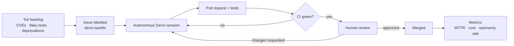

# Overview

> **Status:** Design · **Answers:** What problem does Sentinel solve, and why is Devin the right primitive for it?

## The problem

Every mature codebase carries a backlog of work that is individually low-value and collectively
enormous: dependency CVEs, security findings, flaky and skipped tests, deprecation warnings,
untyped modules, N+1 queries. Apache Superset is a good specimen — a large, actively developed
codebase with a Python backend and a TypeScript frontend.

This work shares a shape that makes it perpetually deprioritised:

- each item is small, so it never wins against feature work in planning;
- there are hundreds of them, so the aggregate risk is real;
- it is unglamorous, so it decays into background toil.

The result is a backlog that grows monotonically and is only paid down after an incident.

## Why this is agent-shaped work

The same properties that make this work unattractive to humans make it ideal for an autonomous
agent:

| Property | Why it matters for an agent |
|---|---|
| **Well-scoped** | Each issue has a clear definition of done. No product ambiguity to negotiate. |
| **CI-verifiable** | Correctness is machine-checkable. The agent gets a ground-truth signal without a human in the loop. |
| **Mutually independent** | Items do not block each other, so N agents can work in parallel with no coordination cost. |
| **Repetitive in kind, varied in detail** | Playbooks generalise across a class, while each instance still needs real investigation. |

## Why Devin specifically

The point is not "an LLM writes a patch." The point is that **the unit of delegation is a task, not
a keystroke.** Devin is given an issue and a repository and left to investigate, change code, run
the test suite, open a pull request, read its own CI failures and fix them. That is what makes this
economically interesting: throughput scales with the number of concurrent sessions, not with
engineer headcount.

The consequence for an engineering organisation is a **shift in the bottleneck** — from
implementation capacity to review capacity. Sentinel is instrumented specifically to measure that
shift ([07](./07-observability.md)): time-to-PR, autonomy rate, fix cycles per merge, and cost per
merged fix.

Concretely, Devin supplies four capabilities Sentinel depends on and would otherwise have to build:

1. **Autonomous execution in a real VM** — it can run Superset's test suite, not just edit text.
2. **Resumable sessions** — a session can be re-engaged with CI output or reviewer feedback and will
   self-correct ([04](./04-state-machine.md)).
3. **Structured output** — a contract for what the agent reports back, which drives the escalation
   path and the dashboard ([05](./05-devin-integration.md)).
4. **Session-level accounting** — ACU consumption per session, which makes cost-per-fix a real
   number rather than an estimate.

## The loop

The loop is closed on both ends. A scheduled Devin session sweeps for new dependency
vulnerabilities and files issues, which re-enter the pipeline at step B ([05](./05-devin-integration.md)).

## Scope

**In scope**

- A single target repository: `taxpon/superset` (fork of `apache/superset`).
- Event sources: GitHub webhooks (issues, pull requests, reviews, check suites) and a scheduled
  vulnerability sweep.
- Remediation across **eight distinct issue classes** (see table below) — deliberately varied, so
  the system is not just a dependency bumper.
- Observability aimed at an engineering leader, not at a dashboard-shaped pile of counters.

**Out of scope**

- Multi-tenant / multi-repository operation. The data model permits it; the deployment does not
  exercise it.
- Merging without human approval. A human approves every merge by design — the goal is to shift the
  bottleneck to review, not to remove review.
- Contributing upstream to `apache/superset`. All pull requests are opened and merged within the
  fork (see [B10](./blockers.md)).

## Issue classes

Each class maps to a playbook, an ACU budget and a baseline engineer-hour estimate used for the
business-impact panel.

| Class | Nature of the work |
|---|---|
| `security` | A genuine vulnerability in Superset's own code — requires root-cause analysis |
| `security-dep` | A CVE fix in a dependency that requires adapting to a breaking API change |
| `bug` | A logic defect (cache key collision, timezone handling, boundary condition) — requires root-cause analysis |
| `frontend-dep` | An npm advisory plus the call-site changes it forces |
| `flaky-test` | A skipped or intermittent test, diagnosed and re-enabled |
| `deprecation` | Removal of deprecated SQLAlchemy / pandas / Flask usage |
| `typing` | Tightening `mypy` on a module, surfacing real defects in the process |
| `perf` | An N+1 query or similar, with before/after measurement |

At least two remediations must demonstrate real diagnosis rather than a version bump; that is an
explicit acceptance criterion in [08](./08-testing.md).

## Glossary

| Term | Meaning |
|---|---|
| **Remediation** | One labelled issue and everything that follows from it. The central aggregate ([03](./03-data-model.md)). |
| **Issue class** | The taxonomy above. Selects playbook, ACU cap and prompt template. |
| **Cycle** | One pass through the review-fix loop. Cycle 0 is the initial attempt; each CI failure or change request increments it. |
| **ACU** | Agent Compute Unit — Devin's billing and effort unit. The basis for all cost metrics. |
| **Blocked** | Devin reported `outcome: blocked` in its structured output, or a policy limit was hit. Escalates to a human. |
| **Autonomy rate** | Share of merged remediations that reached merge with zero fix cycles and zero human messages into the session. |
