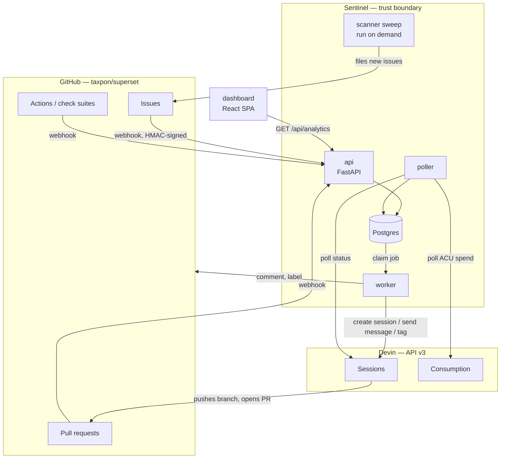
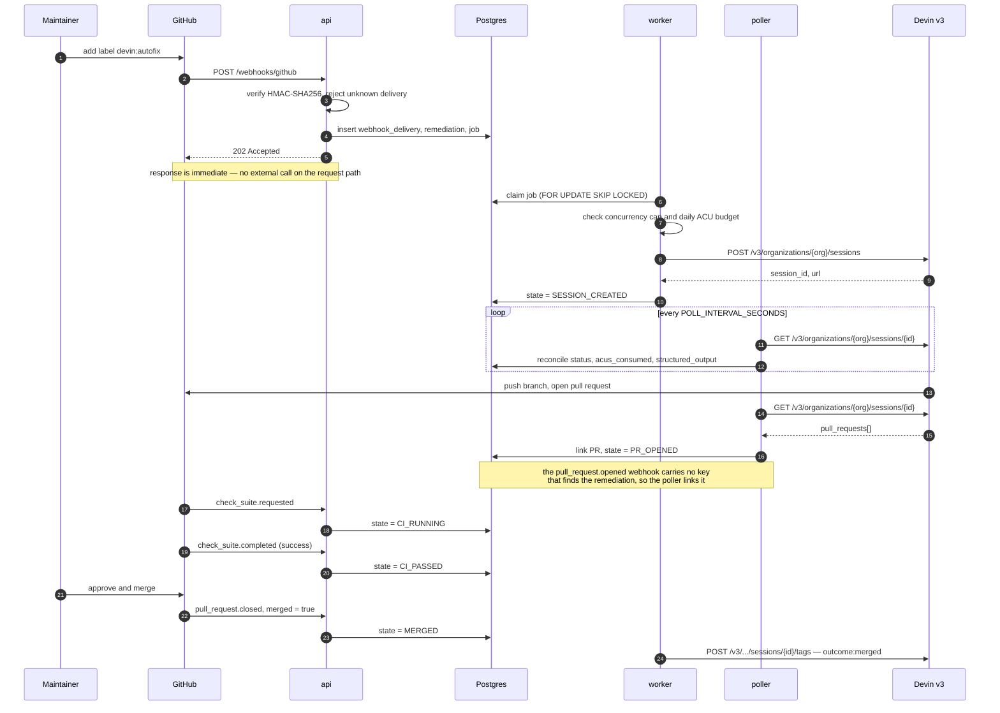

# Architecture

> **Status:** Design · **Answers:** What are the components, how does an event flow through them, and why is it built this way?

## Components

Everything inside the Sentinel boundary is ours. Both external systems are reached over HTTPS with
separate credentials; neither can write to Postgres directly.

## Runtime processes

| Process | Responsibility | Scaling | Failure behaviour |
|---|---|---|---|
| `api` | Terminate webhooks, verify signatures, enqueue work, serve `/api/analytics/*` and the dashboard | Stateless — horizontally scalable | GitHub retries undelivered webhooks; nothing is lost |
| `worker` | Claim jobs, call Devin and GitHub, apply policy (concurrency, budget, retries) | Multiple instances safe via `FOR UPDATE SKIP LOCKED` | Job lease expires and is reclaimed |
| `poller` | Reconcile Devin session state and GitHub PR state into the database | Single instance | Next tick catches up; reconciliation is idempotent |
| `db` | Postgres — durable state, job queue, append-only event log | Single instance | Everything else is stateless around it |

`worker` and `poller` run as separate processes in the same image, selected by command. See
[09](./09-operations.md) for the Compose topology.

## Primary flow

Issue labelled to merged pull request, with no failures:

The failure paths — CI failure and requested changes — re-engage the same session and are specified
in [04](./04-state-machine.md).

## Design decisions

Each row links to the decision record holding the full reasoning and the options that were
rejected. Every record of `type: architecture` has a row here, which `tests/test_gen_adr_index.py`
enforces; the complete list, process decisions included, is [`adr/index.md`](./adr/index.md).

| Decision | Rationale |
|---|---|
| [**The poller drives the state machine**](./adr/2026-08-07-poller-drives-state-machine.md) | The Devin API has no outbound webhook for session status changes (verified against the v3 reference). Session progress is only observable by polling `GET /v3/organizations/{org}/sessions/{id}`. This is not a shortcut — it is the only available mechanism, and it is what keeps the dashboard from going stale ([B4](./blockers.md)). |
| [**Postgres is also the queue**](./adr/2026-08-07-postgres-as-job-queue.md) | The workload is tens of jobs per day, not thousands per second. `SELECT … FOR UPDATE SKIP LOCKED` gives safe multi-worker claiming, and keeping the queue in the same transaction as the remediation row makes enqueue-on-state-change atomic. Adding Redis would add a failure domain and buy nothing at this volume. |
| [**Webhooks return 202 before any external call**](./adr/2026-08-07-respond-202-before-external-calls.md) | GitHub times out webhook deliveries after 10 seconds. Devin session creation is far slower than that and can be rate-limited. Persisting the delivery and enqueuing is the entire request path. |
| [**Two-layer deduplication**](./adr/2026-08-07-two-layer-deduplication.md) | The webhook layer dedups on GitHub's delivery UUID; the domain layer dedups on `(repo, issue_number)`. The first stops replays and retries, the second stops two *different* events about the same issue from opening two sessions ([06](./06-event-pipeline.md)). |
| [**State transitions are events, not just a column**](./adr/2026-08-07-transitions-are-append-only-events.md) | `remediation_event` is append-only. Every metric in [07](./07-observability.md) — MTTR, funnel, fix cycles — is derived from it. A mutable status column alone could not answer "how long did this take" or "how many times did it retry". |
| [**Sessions are resumable and reused**](./adr/2026-08-07-reuse-resumable-sessions.md) | A CI failure re-engages the existing session rather than starting a new one, so Devin retains the context of its own change. This is also what makes fix-cycle count a meaningful autonomy metric. |
| [**Humans approve every merge**](./adr/2026-08-07-humans-approve-every-merge.md) | The goal is to move the bottleneck to review, not to eliminate it. Sentinel never merges on its own. |
| [**Signature verification returns a reason, not a boolean**](./adr/2026-08-08-signature-verification-returns-a-reason.md) | One verification answers three questions: which status code to send (`413` for an oversized body, `401` for a missing, malformed or mismatched signature), what to record for the delivery, and what to log. Every `SignatureResult` member is a fixed identifier derived from no part of the request, so the result is safe to log; the secret and the expected digest never leave the module. |
| [**The state machine is a pure function indexed by trigger**](./adr/2026-08-08-trigger-indexed-state-machine.md) | The webhook handler, the worker and the poller all drive the same transitions, so the table in [04](./04-state-machine.md) is executable: `transition(state, trigger, …)` returns one `Transition` the caller persists as one row. A terminal state absorbs later triggers instead of raising, and the cycle limit is compared in one place rather than in each of the three callers. |
| [**CI states are re-entered from `RUNNING`**](./adr/2026-08-08-ci-states-re-entered-from-running.md) | The fix commits of the second lap are pushed to a pull request that already exists, so their `check_suite` events arrive while the state is `RUNNING`. The widening is bounded by the pull request link rather than by a lap count, which keeps `PR_OPENED` on every path into CI — the funnel, the merge rate and time-to-PR in [07](./07-observability.md) all rest on that. |
| [**The mapping decides what there is to apply**](./adr/2026-08-08-the-mapping-decides-what-there-is-to-apply.md) | The ingress path maps an event before it has a remediation to look at, so `map_event` is pure and `trigger_for(mapped, state)` is a second call made once the state is known. It returns `None` for the rows that change no state — an approval, a forwarded comment — and at both edges of the existence boundary: a delivery about a remediation that was never opened, and a label removed and re-added. Whatever it does return can be applied. Nothing else is absorbed: an impossible sequence still reaches `transition()` and still raises ([06](./06-event-pipeline.md)). |
| [**Cancelling a remediation is recorded as `FAILED`**](./adr/2026-08-08-cancellation-is-recorded-as-failed.md) | [06](./06-event-pipeline.md) gives `issues.unlabeled` and `issues.closed` the intent "cancel if not yet terminal", and [04](./04-state-machine.md) has no trigger and no state for one. `Trigger.FAILED` is legal from every non-terminal state and absorbed by a terminal one, which is that sentence exactly, and the spec already ends an abandoned pull request the same way. The reason is written to `remediation.blocked_reason`, which is what the failure breakdown in [07](./07-observability.md) groups by, so cancellations appear there as named rows rather than as an unlabelled bucket — and escalation is suppressed for them. The success rate counts states, not reasons, so it still counts a cancellation as a failure until a `CANCELLED` state exists. |
| [**The poller links the pull request**](./adr/2026-08-08-the-poller-links-the-pull-request.md) | `remediation` is keyed `(repo, issue_number)` and `pr_number` is null until `PR_OPENED` has been applied, so a `pull_request.opened` webhook carries nothing that can find its remediation — the body is not required to reference the issue, and the recorded one does not. The poller reads `pull_requests[]` from a session whose id it already has, which is attribution by construction rather than by inference. The cost is that `pr_opened_at`, and therefore time-to-PR in [07](./07-observability.md), lags by up to one poll interval. |
| [**The pull request number is parsed out of the URL Devin reports**](./adr/2026-08-10-the-pull-request-number-is-parsed-out-of-its-url.md) | The live API returns `pull_requests[].pr_url` and no number at all (verified 2026-08-10), while `webhooks._criterion` resolves every check suite and every review by `remediation.pr_number` — so a null one silently resolves the whole review-fix loop to no remediation. The number is derived from the `/pull/{n}` segment by `PullRequest`, as a property rather than a validated field so that an unreadable URL fails one remediation instead of the parse of the whole session, and `pr_url` takes no `url` alias now that the name is known ([B8](./blockers.md#b8)). |
| [**The resume handler reads its loop edge from the state**](./adr/2026-08-08-the-resume-edge-is-read-from-the-state.md) | One `resume_session` job kind serves both edges of the review-fix loop, and a job is claimed some time after it is enqueued. `remediation.state` is what the transition is computed from anyway, and the two loop states are unreachable from each other without passing through `RUNNING` — so it selects the message too, and the payload carries only facts the database does not hold, every one of them optional. |
| [**The resume handler reads its loop edge from the state, and drops a job enqueued on the other one**](./adr/2026-08-08-the-resume-edge-is-read-from-the-state.md) | One `resume_session` job kind serves both edges of the review-fix loop, and a job is claimed some time after it is enqueued — up to an hour later behind a rate limit. `CI_FAILED → CI_PASSED → IN_REVIEW → CHANGES_REQUESTED` needs no `RUNNING`, so a CI job can find the review state, and would otherwise fabricate a review, spend a cycle, and leave `RUNNING` behind so the real review's job is discarded. The state selects the edge, the payload is checked against it, and a job the remediation has walked away from is dropped in favour of the fresher one already queued. |
| [**An abandoned pull request still escalates**](./adr/2026-08-09-an-abandoned-pull-request-still-escalates.md) | Three reasons reach `FAILED` through a person deciding something. Removing the label and closing the issue withdraw the request itself, so Sentinel says nothing; closing the pull request unmerged leaves the issue open and still labelled, so it escalates like any other failure. What the suppression set expresses is whether the request was withdrawn, not whether a human meant it. |
| [**A rate limit with an answer defers the job**](./adr/2026-08-08-a-rate-limit-with-an-answer-defers-the-job.md) | A `GitHubRateLimited` carrying `retry_after` is deferred for exactly that long, spending no attempt; one with no delay named falls back to the queue's own backoff. A rejected request had no side effect, and failing a remediation after five retries inside a primary limit that resets in an hour would escalate a quota to a human. |
| [**Devin is called through v3 only**](./adr/2026-08-07-devin-v3-only.md) | v1 and v2 remain reachable and most published examples still use them, but session tags, structured output schemas, `max_acu_limit`, playbook binding and schedules exist only in the organisation-scoped v3 API. A test over the client's route table asserts that no other version appears ([05](./05-devin-integration.md)). |
| [**Devin gets the objective and the constraints, not the steps**](./adr/2026-08-07-delegate-task-not-steps.md) | The prompt carries the issue, the definition of done and the constraints, and nothing about how to investigate. Standing context for a whole class of work lives in playbooks, and repository facts such as how to run the test suite live in knowledge notes, so neither is re-sent with every issue. |
| [**Credentials are `SecretStr`, and configuration errors are rewritten**](./adr/2026-08-08-credentials-are-secretstr-and-config-errors-are-rewritten.md) | Configuration is validated at startup and `pydantic.ValidationError` repeats the value it rejected, so a malformed token would print itself into the first lines of a container's log. `get_settings()` raises `ConfigurationError` naming the variable and the location of the fault, never the input, and the settings object is frozen so nothing can unmask a field later ([09](./09-operations.md)). |
| [**CI green is the aggregate of a head SHA's check runs**](./adr/2026-08-10-ci-green-is-the-aggregate-of-the-check-runs.md) | GitHub raises one check suite per workflow and the fork carries 46, so a conclusion says what one workflow concluded and nothing about the other 45 — and the payload cannot be narrowed to ours, carrying no workflow name and `app.slug: github-actions` for all of them alike. On the first live remediation that put a pull request into review off a `hold`-label check thirteen seconds after it opened, then spent a fix cycle on a `Dependency Review` failure no diff could address. A completed suite now enqueues `evaluate_ci`, which reads every check run on the pull request's head and gates on `devin-autofix-ci`. A failure *outside* our own workflow yields pending rather than failed: it has not judged the diff, and resuming a session over one is what cost the cycle. The ingress path still makes no outbound call. |
| [**A merge is recorded from any state, and the state is left where it is**](./adr/2026-08-10-a-merge-is-recorded-from-any-state.md) | `PR_MERGED` is legal only from `IN_REVIEW`, so a `BLOCKED` remediation whose escalation a human resolved by merging absorbed the trigger, `merged_at` was never stamped, and the funnel read `merged: 0` beside a link to a merged pull request. Terminal for *work* had been allowed to mean terminal for *observation*. `merged_at` is now written from the trigger whatever the state, and the funnel counts merges from that column rather than from `state`. The state stays put: flattening `BLOCKED` to `MERGED` would erase the escalation, and `BLOCKED` with a merge time is exactly what "Devin escalated, then a person merged it" is. |
| [**A session is adopted before it is created, and the create is sent once**](./adr/2026-08-11-a-session-is-adopted-before-it-is-created.md) | Devin's API stopped answering `POST …/sessions` inside the 30 s timeout on 2026-08-11 while still serving the requests, so three transport retries made three sessions — nine across three issues. A read timeout is not a failed request, and the v3 create takes no idempotency key of any kind, so no resend can be marked as one. `create_session` therefore lists sessions by the remediation's identity tags (`sentinel`, `repo:<r>`, `issue:<n>`) and adopts a match instead of posting; only when nothing matches is a session created, and then exactly once. Keying on the remediation rather than on `run:<delivery_id>` is what also covers the *job* being retried minutes later — the layer a narrower retry policy would have missed. A lookup that cannot answer fails the job rather than creating on a guess, which makes `ViewOrgSessions` a prerequisite for creating a session ([05](./05-devin-integration.md)). |
| [**A fork CI run with nothing to test reports success**](./adr/2026-08-08-vacuous-ci-reports-success.md) | GitHub concludes an all-skipped workflow as `skipped`, which maps to no transition — the remediation would sit in `CI_RUNNING` with nothing to move it and nothing to escalate it. The aggregate job runs with `if: always()` and reports success with a `::warning::` stating that the conclusion reflects `pre-commit` only. |
| [**Credentials are scrubbed from log values, not only from credential-shaped keys**](./adr/2026-08-08-log-redaction-scrubs-values-not-only-keys.md) | Filtering on field names misses the commonest leak — a token interpolated into a message — and `SecretStr` stops masking the moment `.get_secret_value()` is called. Redaction is a processor in the `structlog` chain, so no call site can opt out, and it matches by value, by shape and by key name. |
| [**Prometheus metrics are process-local**](./adr/2026-08-08-metrics-are-process-local.md) | `api`, `worker` and `poller` are separate processes and do not share a registry, so a counter incremented in the worker is invisible to the endpoint the API serves. Figures that span processes — queue depth, poller lag — are read from the database at scrape time by whoever serves `/metrics`, which also keeps them consistent with `/api/analytics/summary` ([07](./07-observability.md)). |
| [**`DEVIN_PLAYBOOK_IDS` accepts either an issue class or a playbook name**](./adr/2026-08-08-playbook-ids-keyed-by-class-or-name.md) | Four playbooks cover eight issue classes, so a map keyed strictly by class would repeat the same id four times and drift the first time one changed. Either key resolves, and a class with no id raises `MissingPlaybookId` — an operator misconfiguration — rather than the `UnknownIssueClass` that escalates to a human ([05](./05-devin-integration.md)). |
| [**A resumed session is told which cycle it is on, and how many remain**](./adr/2026-08-08-resume-messages-state-the-cycle-budget.md) | The fix budget is enforced by the state machine, so without it the session cannot tell a first attempt from its last. The message states the cycle and offers `blocked` as an outcome; it does not suggest what to try, which would be the step-level steering the prompts deliberately avoid ([04](./04-state-machine.md)). |
| [**Tests run against the migrated schema, never against `create_all`**](./adr/2026-08-08-migrations-are-the-schema-tests-run-against.md) | Every schema test starts from an empty database and runs `alembic upgrade head`, so what is exercised is the schema the migration produces rather than one the models would have produced. A model changed without a migration therefore fails in the suite instead of at deployment, and autogenerate is asked to compare types and server defaults so the comparison can actually see the drift ([03](./03-data-model.md)). |
| [**Tests are isolated by the harness, which truncates between them**](./adr/2026-08-08-tests-are-isolated-by-the-harness.md) | The queue tests need two connections that can see each other's committed rows, so wrapping each test in a transaction and rolling it back would make every `SKIP LOCKED` test vacuous, while re-running the migrations per test costs three times as much. `tests/conftest.py` truncates before each test and re-migrates only when the schema is missing, and it resets `structlog`, the settings cache and the metrics registry for every test whether the test asked or not ([08](./08-testing.md)). |
| [**Dashboard panels self-register from a directory**](./adr/2026-08-08-panels-self-register-from-the-panels-directory.md) | T31, T32 and T33 add panels in parallel without seeing each other's code, so a hand-maintained registry in the shell would be the one file all three must edit. Each panel exports a component, a title and a slot, and the shell discovers them — but the compiler does not enforce that contract, so the shell validates each module at runtime and names one it cannot mount rather than dropping it silently. |
| [**Recharts draws the dashboard**](./adr/2026-08-08-recharts-for-the-dashboard-charts.md) | Browser-level tests are out of scope, which leaves component tests as the only automated check — so the library has to render meaningfully under jsdom. Recharts does; canvas-based libraries do not without a canvas shim. T31 to T33 all inherit the choice, which is why it is recorded here rather than left to whichever panel task landed first ([07](./07-observability.md)). |
| [**A GitHub rate-limit wait is bounded, and the remainder is handed back to the queue**](./adr/2026-08-08-github-waits-are-bounded-and-handed-back-to-the-queue.md) | GitHub's primary limit resets up to an hour later, and every GitHub call happens inside a job whose lease expires after 15 minutes — so sleeping it out would get the job reclaimed and the comment posted twice. The client waits in-process for at most 60 seconds *in total across one call*, which covers the secondary limit and a transient `5xx` on a read, and otherwise raises `GitHubRateLimited` carrying the `retry_after` GitHub named — and `None` when it named none, rather than a guess wearing GitHub's authority. A `5xx` on a write is never repeated in place, because a `502` can follow a comment that was created ([06](./06-event-pipeline.md)). |
| [**The CI excerpt comes from the earliest failing job of the latest failing run**](./adr/2026-08-08-the-ci-excerpt-comes-from-the-earliest-failing-job.md) | A failed head SHA on the fork has at least two failing jobs, because the aggregate job fails whenever a signal job does, and its log says only that. The client resolves the log through the Actions API — latest failing run, earliest failing job, tie-broken on id — so the excerpt Devin is resumed with is the cause rather than a consequence, chosen without naming a job in `devin-autofix-ci.yml`. A job with no start time ranks last rather than at the epoch, and an expired log yields an empty excerpt rather than failing the remediation ([04](./04-state-machine.md)). |
| [**The live panels impose their own total order, tie-broken on id**](./adr/2026-08-08-live-panels-sort-client-side-with-an-id-tiebreak.md) | `remediation_event.created_at` is `now()`, which is `transaction_timestamp()`, and [06](./06-event-pipeline.md) writes the transition, the event and the job in one transaction — so tied timestamps are routine and ordering on time alone reshuffles the timeline between polls. Both panels sort what they received: the timeline by `(created_at, id)` ascending, the live table by lifecycle then `(labeled_at, id)` descending, so a row moves only when something about it changed. |
| [**The Devin client composes the create-session body itself**](./adr/2026-08-08-the-client-composes-the-session-request.md) | Ten derived fields go into a session, and two of them fail invisibly: a tag outside the registered vocabulary is a `422` at creation ([B7](./blockers.md)), and a session created without `resumable` or without the structured-output schema succeeds and breaks a cycle later. `create_session` takes the issue and builds the body from [`playbooks.py`](./05-devin-integration.md), so there is one composition rather than one per caller, and the tags are validated before anything is sent. |
| [**The budget guard spends against the highest figure any source reports**](./adr/2026-08-08-the-budget-guard-spends-against-the-highest-figure-any-source-reports.md) | Three sources describe today's ACU spend and each is incomplete differently: Devin's own figure degrades to `Unavailable` without consumption scope and reports an undocumented window ([B8](./blockers.md)), `acu_ledger` is organisation-wide but only as fresh as the last sync, and `sum(acus_consumed)` is current but blind to sessions Sentinel did not create. None can invent spend, so the guard takes the maximum and reserves the class's `max_acu_limit` before comparing — an unavailable figure removes a source rather than relaxing the ceiling. Its own sum counts the remediations labelled today *and* those in flight now, because on the deployment where the other two are absent nothing else would see a session labelled yesterday that is still burning ACUs ([06](./06-event-pipeline.md)). |
| [**The policy releases the job it refuses, and decides the terminal verdict first**](./adr/2026-08-08-the-policy-releases-the-job-it-refuses.md) | Four things stop a `create_session` job before it calls Devin and each ends it differently — the cap defers without spending an attempt, the budget writes a `BLOCKED` remediation, its event and an `escalate` job in one transaction. `admit_session()` performs the ending and returns a `Decision`, so a handler's whole obligation is to return when it is not admitted. The budget is decided before the cap, because deferring first would let a busy queue postpone an escalation indefinitely and leave the cost ceiling invisible ([04](./04-state-machine.md)). |
| [**Enterprise degradation is a returned value, not an exception**](./adr/2026-08-08-enterprise-degradation-is-a-returned-value.md) | The capabilities in the degradation table of [05](./05-devin-integration.md) may be unreachable with organisation-level credentials ([B5](./blockers.md), [B6](./blockers.md)), and each has a defined fallback. `403`, `404` and an unconfigured enterprise id return `Unavailable` carrying the reason and the fallback text, so the caller must write the branch instead of remembering a `try`; `401` and everything else still raise, because a rejected token is a fault to fix rather than a capability to work around. |
| [**The timeline panel selects its own remediation**](./adr/2026-08-08-timeline-panel-selects-its-own-remediation.md) | `GET /api/remediations/{id}` needs an id, and clicking a live-table row would need selection state above both panels — in `App.tsx`, which the panel tasks do not own. The panel polls the rows itself, defaults to the newest remediation still in flight, and offers a `select` for the rest ([07](./07-observability.md)). |
| [**Every figure is computed over the remediations the window labelled**](./adr/2026-08-08-the-window-selects-remediations-by-labeled-at.md) | [07](./07-observability.md) scopes the window on `labeled_at` and then defines metrics over five other timestamps. One set of rows underlies the whole payload, so the funnel counts stay usable as each other's denominators: `throughput` reports the merge day even when it falls outside the window, and the fix-cycle distribution sums to `funnel.labelled` rather than to the merges. |
| [**A published percentile is an observed duration**](./adr/2026-08-08-percentiles-are-nearest-rank-observations.md) | A seven-day window holds a handful of merges, and interpolation would answer MTTR with a duration no remediation took — breaking the reading "nine out of ten fixes landed within X" that every row on the dashboard is meant to be checkable against. The value is the sorted sample's `ceil(rank/100 × n)`-th, so it is always a measurement someone can click through to ([07](./07-observability.md)). |
| [**ACU totals are summed from the window's remediations**](./adr/2026-08-08-acu-totals-are-summed-from-remediations-and-labelled-by-ledger-coverage.md) — **superseded** | `acu_ledger` is an organisation-wide daily total that cannot be cut at a window boundary, so `cost.acus_total` summed `acus_consumed` over the window instead and `cost.source` reported whether the sync covered every day of it. Superseded by the removal of spend reporting: the totals it defined are no longer computed or served. |
| [**A session that ends with nothing to show fails the remediation**](./adr/2026-08-08-a-session-with-nothing-to-show-fails.md) | A Devin session can finish having produced no pull request — it exits, or spends `ACU_CAPS[issue_class]`, and GitHub sends nothing because nothing happened on GitHub. Without this the remediation sits in `RUNNING` for ever, costing a request per tick and counting as in flight in every funnel denominator. The poller applies `FAILED` with the reason that fits — `acu_cap_exhausted`, `session_error` or `session_ended_without_pull_request` — but only while no pull request is linked, because a remediation holding one is carried the rest of the way by check suites and a reviewer ([04](./04-state-machine.md)). |
| [**The poller records only the observations that move a remediation**](./adr/2026-08-08-the-poller-records-only-what-moves.md) | An absorbed trigger writes no `remediation_event`. The rule in [04](./04-state-machine.md) that a repeat observation is "recorded and otherwise ignored" was written for webhooks, which arrive once per real event; the poller re-reads the same session every `POLL_INTERVAL_SECONDS`, so recording each one would put three orders of magnitude more rows in an append-only log whose content would be "nothing changed". The absorption still happens in the state machine — `PR_OPENED` is applied on every tick and `PullRequestCondition.UNLINKED` is what makes the link write-once, rather than a second copy of that rule in the poller. |
| [**A session running and waiting for a user is blocked**](./adr/2026-08-08-a-stalled-session-is-blocked.md) | `status_detail: waiting_for_user` on a session Devin reports as `running` is a question asked of nobody: the only messages Sentinel sends are the resume messages of the fix loop. It escalates on the first observation with `blocked_reason = session_waiting_for_user`, because no number of further polls can produce an answer — **while the session has no pull request to show**, which is the condition the record below adds. The status set is the poller's own and is narrower than `is_working` — `resuming` is a session that has *just* been sent a message, so a `waiting_for_user` on it may predate that message, and `BLOCKED` is terminal ([05](./05-devin-integration.md)). |
| [**A question asked after the pull request is an offer, not a stall**](./adr/2026-08-10-an-offer-after-the-pull-request-is-not-a-stall.md) | Devin ends a session by offering to do something further — run the app end to end, take a related fix — and asking sets the same `waiting_for_user` as being stuck. On the live re-run of issue #5 that escalated a finished remediation 41 seconds after its pull request opened, on `cycle: 0`; one for one, it would have ended all eight at `BLOCKED` — and since `BLOCKED` is terminal, nothing would have merged and the autonomy rate would not have read 0% but would not have existed at all ([ADR](./adr/2026-08-08-blank-a-figure-whose-denominator-is-empty.md)). The pull request is what separates the two: with one, the remediation carries on through CI and review and the question is recorded once per fix cycle as a `devin_call` observation — with the log itself, not a flag in the poller, answering whether it has been recorded, and a `SAVEPOINT` keeping a failure to write it from rolling back the transitions it annotates ([04](./04-state-machine.md)). |
| [**One statement claims, un-defers and reclaims, and the lease it grants fences the release**](./adr/2026-08-08-one-claim-statement-and-a-fenced-lease.md) | The statement in [06](./06-event-pipeline.md) selects `pending` rows, but two more must eventually run: a job `deferred` by the concurrency cap, and one whose worker died holding it. Both join the same `FOR UPDATE SKIP LOCKED` subquery, so taking a job is still one round trip and `run_after` stays the only thing that decides when work is due. Reclaiming leaves `attempts` alone — it counts failures a worker reported, and it is what the backoff is computed from — and `complete()`, `fail()` and `defer()` match on `locked_by`, so a worker that stalled past its lease cannot decide the outcome of a job somebody else is now running. |
| [**Retry jitter takes away at most half the delay**](./adr/2026-08-08-equal-jitter-keeps-the-backoff-cap-a-ceiling.md) | [06](./06-event-pipeline.md) fixes the schedule at `2^attempts × 5 s` capped at ten minutes but not the shape of the jitter, and the shape decides whether that cap is still true. Equal jitter — half the delay plus a random half — keeps the published schedule as the upper bound of what any job waits, while still separating workers that failed on the same rate limit. Full jitter would spread them further, at the price of retrying a `429` almost immediately. |
| [**A figure with an empty denominator is blank, not zero**](./adr/2026-08-08-blank-a-figure-whose-denominator-is-empty.md) | Every rate and percentile in [07](./07-observability.md) divides by a funnel stage, and the response schema types them all as plain numbers — so a window that merged nothing arrives as `"autonomy": 0` and `"to_merge": {"p50": 0}`, indistinguishable from instant, fully autonomous merges. Panels gate each figure on the funnel count it was computed over and render `—` with the reason instead. A zero that is a measurement, such as a fix-cycle count, is kept. |
| [**The cost panel labels its ACUs and its dollars separately**](./adr/2026-08-08-cost-panel-labels-acu-and-dollar-provenance-separately.md) — **deprecated** | `cost.source` said only where the ACU counts came from, and the panel stated the dollar conversion separately so that no figure was attributed to Devin that Devin had not reported. Deprecated with the panel it constrained: spend reporting was removed, so there is no longer a provenance to label. |
| [**Spend reporting is removed, because the account is not billed in ACUs**](./adr/2026-08-10-spend-reporting-is-removed-because-the-account-is-not-billed-in-acus.md) | Devin reports consumption only in ACUs, and this self-serve account reports none: a session its own UI prices at $3.50 returns `acus_consumed: 0.0`. Every spend figure was therefore structurally zero however much work had been done, so `cost` leaves the summary payload, the cost panel and the KPI row's fourth tile go, and `ACU_UNIT_COST_USD` stops being configuration. The daily budget guard stays — it is admission policy, not reporting — as does `remediation.acus_consumed`, which the guard reads and the live table shows as the recorded observation it is ([07](./07-observability.md)). |
| [**A figure with no denominator is an em dash**](./adr/2026-08-08-an-undefined-figure-is-an-em-dash.md) | Panels render the figure the analytics API computed and read the funnel only to decide whether it exists: nothing labelled makes the success rate undefined rather than 0%, because "0% success" claims the pipeline failed when nobody asked it to do anything. Recomputing a rate inside a panel would also print a different number from the one its neighbour shows, since the payload's figures are already display-rounded ([07](./07-observability.md)). |
| [**The analytics API serves the metrics module's own schema**](./adr/2026-08-08-the-metrics-module-is-the-published-schema.md) | The summary body is fixed in [07](./07-observability.md) and already transcribed twice — as `TypedDict`s in `sentinel.analytics.metrics` and as interfaces in `dashboard/src/api.ts`, which every panel indexes into. `metrics.SummaryJson` is handed to FastAPI as the response model rather than restated as Pydantic models in the router, so a dropped key fails the request instead of reaching the dashboard, and `parse_window` stays the only definition of a valid window — the boundary translates its `ValueError` into a `400` naming the 365-day ceiling. |
| [**The asyncpg driver is applied to `DATABASE_URL`, not demanded**](./adr/2026-08-10-the-asyncpg-driver-is-applied-not-demanded.md) | Naming a driver in a connection URL is SQLAlchemy's convention; every managed provider issues `postgres://` or `postgresql://`, and `fly postgres attach` writes one into the app's secrets with no human in between. Demanding the exact scheme turned the documented way to attach a database into a crash loop, so the bare schemes have the driver applied and only a URL naming a *different* one is still rejected at startup. `alembic/env.py` borrows the same function, because on Fly the migration is the release command and fails first ([09](./09-operations.md#deployment-flyio)). |
| [**A script loads the configuration group it reads**](./adr/2026-08-10-a-script-loads-the-configuration-group-it-reads.md) | `Settings` holds every variable of the table in [09](./09-operations.md#configuration), so a script that only files issues on the fork refused to start without Devin credentials and a `DATABASE_URL` — and its dry run, the mode that exists to be safe before anything is configured, was blocked identically. The variables are declared in groups and `Settings` is the composition of all of them; `load_config(model)` reads one group, or a composition a script declares, with the same `SecretStr`, `.env` handling and variable-naming errors, because it is the same model. Services load the whole of `Settings` and still fail at startup on any missing variable. |

## What crosses the boundary

| Direction | Credential | Scope |
|---|---|---|
| GitHub → `api` | Shared webhook secret, HMAC-SHA256 | Signature verification only; no GitHub identity is trusted from the payload |
| `worker`/`poller` → Devin | Service-user token (`cog_` prefix) | Session create/read/message/tag, consumption read |
| `worker` → GitHub | Fine-grained PAT | Issue comments and labels on the target repo. Sentinel never merges |
| Browser → `api` | None (local deployment) | Read-only analytics endpoints |
