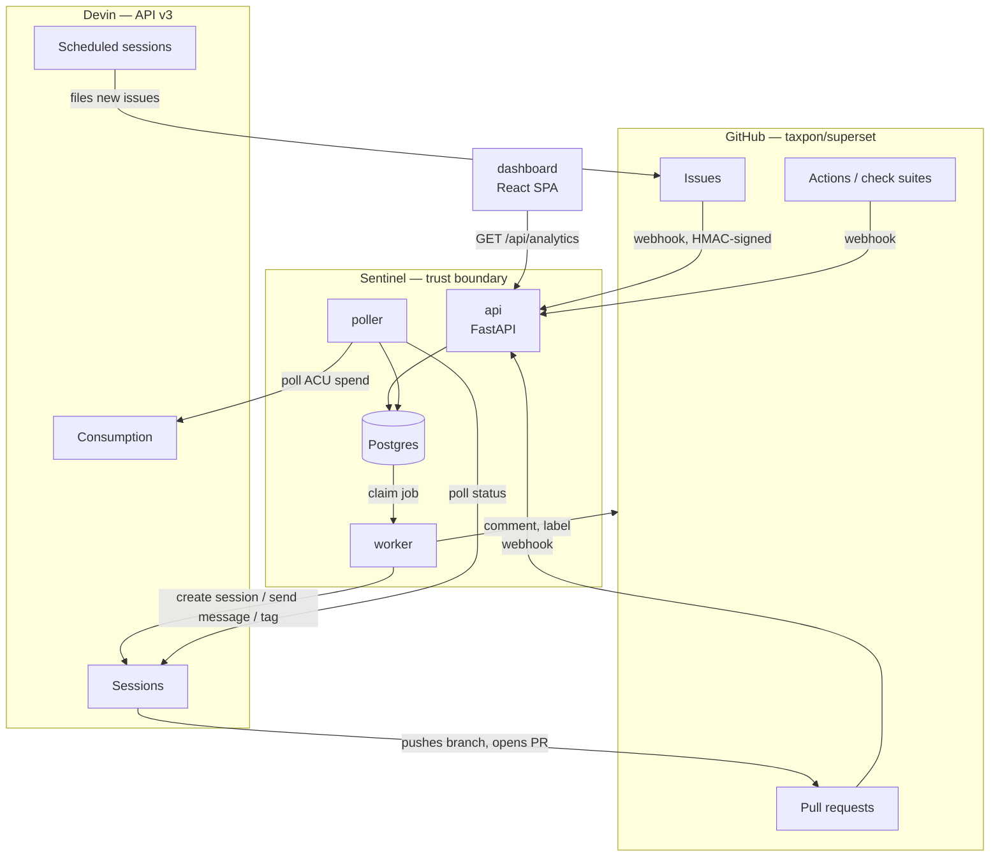
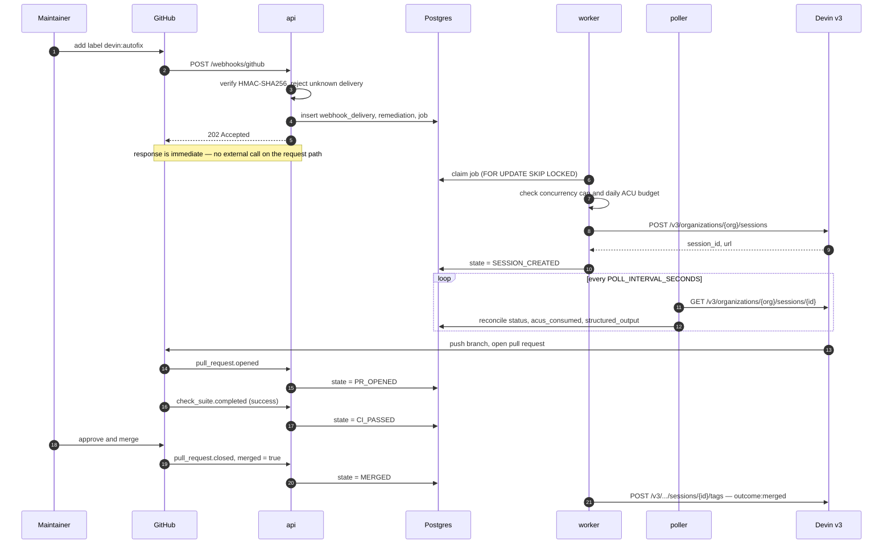

# Architecture

> **Status:** Design · **Answers:** What are the components, how does an event flow through them, and why is it built this way?

## Components

Everything inside the Sentinel boundary is ours. Both external systems are reached over HTTPS with
separate credentials; neither can write to Postgres directly.

## Runtime processes

| Process | Responsibility | Scaling | Failure behaviour |
|---|---|---|---|
| `api` | Terminate webhooks, verify signatures, enqueue work, serve `/api/analytics/*` and the dashboard | Stateless — horizontally scalable | GitHub retries undelivered webhooks; nothing is lost |
| `worker` | Claim jobs, call Devin and GitHub, apply policy (concurrency, budget, retries) | Multiple instances safe via `FOR UPDATE SKIP LOCKED` | Job lease expires and is reclaimed |
| `poller` | Reconcile Devin session state and GitHub PR state into the database | Single instance | Next tick catches up; reconciliation is idempotent |
| `db` | Postgres — durable state, job queue, append-only event log | Single instance | Everything else is stateless around it |

`worker` and `poller` run as separate processes in the same image, selected by command. See
[09](./09-operations.md) for the Compose topology.

## Primary flow

Issue labelled to merged pull request, with no failures:

The failure paths — CI failure and requested changes — re-engage the same session and are specified
in [04](./04-state-machine.md).

## Design decisions

Each row links to the decision record holding the full reasoning and the options that were
rejected. Every record of `type: architecture` has a row here, which `tests/test_gen_adr_index.py`
enforces; the complete list, process decisions included, is [`adr/index.md`](./adr/index.md).

| Decision | Rationale |
|---|---|
| [**The poller drives the state machine**](./adr/2026-08-07-poller-drives-state-machine.md) | The Devin API has no outbound webhook for session status changes (verified against the v3 reference). Session progress is only observable by polling `GET /v3/organizations/{org}/sessions/{id}`. This is not a shortcut — it is the only available mechanism, and it is what keeps the dashboard from going stale ([B4](./blockers.md)). |
| [**Postgres is also the queue**](./adr/2026-08-07-postgres-as-job-queue.md) | The workload is tens of jobs per day, not thousands per second. `SELECT … FOR UPDATE SKIP LOCKED` gives safe multi-worker claiming, and keeping the queue in the same transaction as the remediation row makes enqueue-on-state-change atomic. Adding Redis would add a failure domain and buy nothing at this volume. |
| [**Webhooks return 202 before any external call**](./adr/2026-08-07-respond-202-before-external-calls.md) | GitHub times out webhook deliveries after 10 seconds. Devin session creation is far slower than that and can be rate-limited. Persisting the delivery and enqueuing is the entire request path. |
| [**Two-layer deduplication**](./adr/2026-08-07-two-layer-deduplication.md) | The webhook layer dedups on GitHub's delivery UUID; the domain layer dedups on `(repo, issue_number)`. The first stops replays and retries, the second stops two *different* events about the same issue from opening two sessions ([06](./06-event-pipeline.md)). |
| [**State transitions are events, not just a column**](./adr/2026-08-07-transitions-are-append-only-events.md) | `remediation_event` is append-only. Every metric in [07](./07-observability.md) — MTTR, funnel, fix cycles — is derived from it. A mutable status column alone could not answer "how long did this take" or "how many times did it retry". |
| [**Sessions are resumable and reused**](./adr/2026-08-07-reuse-resumable-sessions.md) | A CI failure re-engages the existing session rather than starting a new one, so Devin retains the context of its own change. This is also what makes fix-cycle count a meaningful autonomy metric. |
| [**Humans approve every merge**](./adr/2026-08-07-humans-approve-every-merge.md) | The goal is to move the bottleneck to review, not to eliminate it. Sentinel never merges on its own. |
| [**Signature verification returns a reason, not a boolean**](./adr/2026-08-08-signature-verification-returns-a-reason.md) | One verification answers three questions: which status code to send (`413` for an oversized body, `401` for a missing, malformed or mismatched signature), what to record for the delivery, and what to log. Every `SignatureResult` member is a fixed identifier derived from no part of the request, so the result is safe to log; the secret and the expected digest never leave the module. |
| [**The state machine is a pure function indexed by trigger**](./adr/2026-08-08-trigger-indexed-state-machine.md) | The webhook handler, the worker and the poller all drive the same transitions, so the table in [04](./04-state-machine.md) is executable: `transition(state, trigger, …)` returns one `Transition` the caller persists as one row. A terminal state absorbs later triggers instead of raising, and the cycle limit is compared in one place rather than in each of the three callers. |
| [**CI states are re-entered from `RUNNING`**](./adr/2026-08-08-ci-states-re-entered-from-running.md) | The fix commits of the second lap are pushed to a pull request that already exists, so their `check_suite` events arrive while the state is `RUNNING`. The widening is bounded by the pull request link rather than by a lap count, which keeps `PR_OPENED` on every path into CI — the funnel, the merge rate and time-to-PR in [07](./07-observability.md) all rest on that. |
| [**Devin is called through v3 only**](./adr/2026-08-07-devin-v3-only.md) | v1 and v2 remain reachable and most published examples still use them, but session tags, structured output schemas, `max_acu_limit`, playbook binding and schedules exist only in the organisation-scoped v3 API. A test over the client's route table asserts that no other version appears ([05](./05-devin-integration.md)). |
| [**Devin gets the objective and the constraints, not the steps**](./adr/2026-08-07-delegate-task-not-steps.md) | The prompt carries the issue, the definition of done and the constraints, and nothing about how to investigate. Standing context for a whole class of work lives in playbooks, and repository facts such as how to run the test suite live in knowledge notes, so neither is re-sent with every issue. |
| [**Credentials are `SecretStr`, and configuration errors are rewritten**](./adr/2026-08-08-credentials-are-secretstr-and-config-errors-are-rewritten.md) | Configuration is validated at startup and `pydantic.ValidationError` repeats the value it rejected, so a malformed token would print itself into the first lines of a container's log. `get_settings()` raises `ConfigurationError` naming the variable and the location of the fault, never the input, and the settings object is frozen so nothing can unmask a field later ([09](./09-operations.md)). |
| [**A fork CI run with nothing to test reports success**](./adr/2026-08-08-vacuous-ci-reports-success.md) | GitHub concludes an all-skipped workflow as `skipped`, which maps to no transition — the remediation would sit in `CI_RUNNING` with nothing to move it and nothing to escalate it. The aggregate job runs with `if: always()` and reports success with a `::warning::` stating that the conclusion reflects `pre-commit` only. |
| [**Credentials are scrubbed from log values, not only from credential-shaped keys**](./adr/2026-08-08-log-redaction-scrubs-values-not-only-keys.md) | Filtering on field names misses the commonest leak — a token interpolated into a message — and `SecretStr` stops masking the moment `.get_secret_value()` is called. Redaction is a processor in the `structlog` chain, so no call site can opt out, and it matches by value, by shape and by key name. |
| [**Prometheus metrics are process-local**](./adr/2026-08-08-metrics-are-process-local.md) | `api`, `worker` and `poller` are separate processes and do not share a registry, so a counter incremented in the worker is invisible to the endpoint the API serves. Figures that span processes — queue depth, poller lag — are read from the database at scrape time by whoever serves `/metrics`, which also keeps them consistent with `/api/analytics/summary` ([07](./07-observability.md)). |
| [**`DEVIN_PLAYBOOK_IDS` accepts either an issue class or a playbook name**](./adr/2026-08-08-playbook-ids-keyed-by-class-or-name.md) | Four playbooks cover eight issue classes, so a map keyed strictly by class would repeat the same id four times and drift the first time one changed. Either key resolves, and a class with no id raises `MissingPlaybookId` — an operator misconfiguration — rather than the `UnknownIssueClass` that escalates to a human ([05](./05-devin-integration.md)). |
| [**A resumed session is told which cycle it is on, and how many remain**](./adr/2026-08-08-resume-messages-state-the-cycle-budget.md) | The fix budget is enforced by the state machine, so without it the session cannot tell a first attempt from its last. The message states the cycle and offers `blocked` as an outcome; it does not suggest what to try, which would be the step-level steering the prompts deliberately avoid ([04](./04-state-machine.md)). |
| [**Tests run against the migrated schema, never against `create_all`**](./adr/2026-08-08-migrations-are-the-schema-tests-run-against.md) | Every schema test starts from an empty database and runs `alembic upgrade head`, so what is exercised is the schema the migration produces rather than one the models would have produced. A model changed without a migration therefore fails in the suite instead of at deployment, and autogenerate is asked to compare types and server defaults so the comparison can actually see the drift ([03](./03-data-model.md)). |
| [**Tests are isolated by the harness, which truncates between them**](./adr/2026-08-08-tests-are-isolated-by-the-harness.md) | The queue tests need two connections that can see each other's committed rows, so wrapping each test in a transaction and rolling it back would make every `SKIP LOCKED` test vacuous, while re-running the migrations per test costs three times as much. `tests/conftest.py` truncates before each test and re-migrates only when the schema is missing, and it resets `structlog`, the settings cache and the metrics registry for every test whether the test asked or not ([08](./08-testing.md)). |
| [**Dashboard panels self-register from a directory**](./adr/2026-08-08-panels-self-register-from-the-panels-directory.md) | T31, T32 and T33 add panels in parallel without seeing each other's code, so a hand-maintained registry in the shell would be the one file all three must edit. Each panel exports a component, a title and a slot, and the shell discovers them — but the compiler does not enforce that contract, so the shell validates each module at runtime and names one it cannot mount rather than dropping it silently. |
| [**Recharts draws the dashboard**](./adr/2026-08-08-recharts-for-the-dashboard-charts.md) | Browser-level tests are out of scope, which leaves component tests as the only automated check — so the library has to render meaningfully under jsdom. Recharts does; canvas-based libraries do not without a canvas shim. T31 to T33 all inherit the choice, which is why it is recorded here rather than left to whichever panel task landed first ([07](./07-observability.md)). |
| [**A GitHub rate-limit wait is bounded, and the remainder is handed back to the queue**](./adr/2026-08-08-github-waits-are-bounded-and-handed-back-to-the-queue.md) | GitHub's primary limit resets up to an hour later, and every GitHub call happens inside a job whose lease expires after 15 minutes — so sleeping it out would get the job reclaimed and the comment posted twice. The client waits in-process for at most 60 seconds, which covers the secondary limit and a transient `5xx`, and otherwise raises `GitHubRateLimited` with the `retry_after` GitHub named for the queue to schedule ([06](./06-event-pipeline.md)). |
| [**The CI excerpt comes from the earliest failing job of the latest failing run**](./adr/2026-08-08-the-ci-excerpt-comes-from-the-earliest-failing-job.md) | A failed head SHA on the fork has at least two failing jobs, because the aggregate job fails whenever a signal job does, and its log says only that. The client resolves the log through the Actions API — latest failing run, earliest failing job, tie-broken on id — so the excerpt Devin is resumed with is the cause rather than a consequence, chosen without naming a job in `devin-autofix-ci.yml` ([04](./04-state-machine.md)). |
| [**The live panels impose their own total order, tie-broken on id**](./adr/2026-08-08-live-panels-sort-client-side-with-an-id-tiebreak.md) | `remediation_event.created_at` is `now()`, which is `transaction_timestamp()`, and [06](./06-event-pipeline.md) writes the transition, the event and the job in one transaction — so tied timestamps are routine and ordering on time alone reshuffles the timeline between polls. Both panels sort what they received: the timeline by `(created_at, id)` ascending, the live table by lifecycle then `(labeled_at, id)` descending, so a row moves only when something about it changed. |
| [**The timeline panel selects its own remediation**](./adr/2026-08-08-timeline-panel-selects-its-own-remediation.md) | `GET /api/remediations/{id}` needs an id, and clicking a live-table row would need selection state above both panels — in `App.tsx`, which the panel tasks do not own. The panel polls the rows itself, defaults to the newest remediation still in flight, and offers a `select` for the rest ([07](./07-observability.md)). |

## What crosses the boundary

| Direction | Credential | Scope |
|---|---|---|
| GitHub → `api` | Shared webhook secret, HMAC-SHA256 | Signature verification only; no GitHub identity is trusted from the payload |
| `worker`/`poller` → Devin | Service-user token (`cog_` prefix) | Session create/read/message/tag, consumption read |
| `worker` → GitHub | Fine-grained PAT | Issue comments and labels on the target repo. Sentinel never merges |
| Browser → `api` | None (local deployment) | Read-only analytics endpoints |
