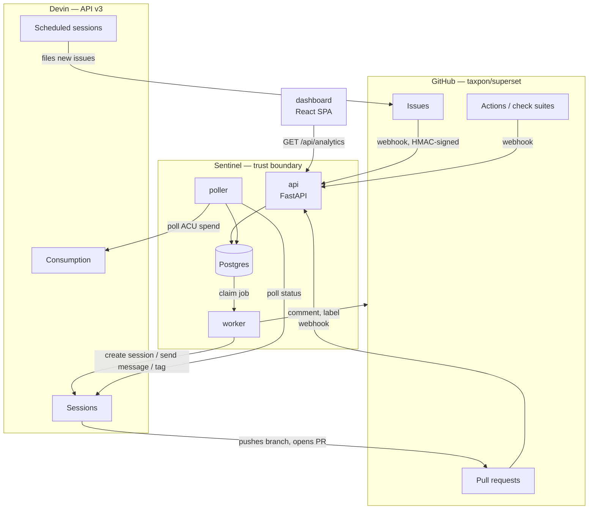
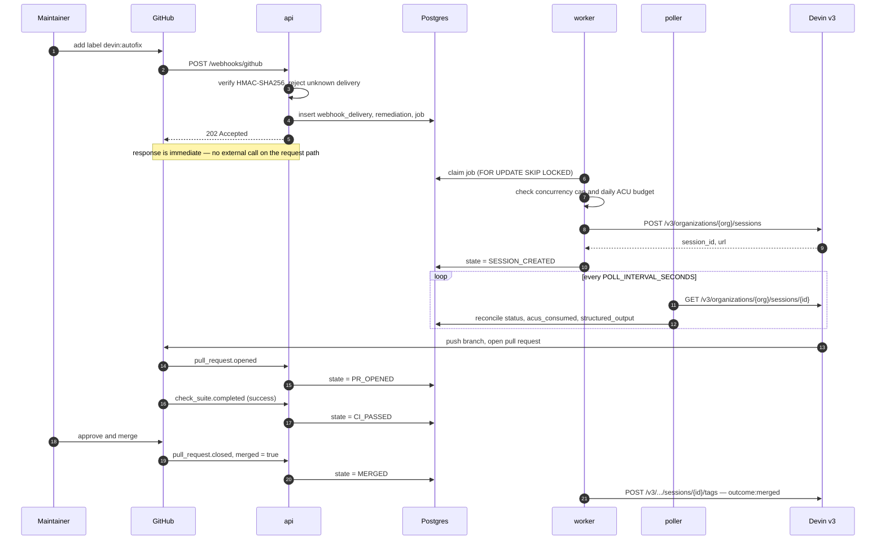

# Architecture

> **Status:** Design · **Answers:** What are the components, how does an event flow through them, and why is it built this way?

## Components

Everything inside the Sentinel boundary is ours. Both external systems are reached over HTTPS with
separate credentials; neither can write to Postgres directly.

## Runtime processes

| Process | Responsibility | Scaling | Failure behaviour |
|---|---|---|---|
| `api` | Terminate webhooks, verify signatures, enqueue work, serve `/api/analytics/*` and the dashboard | Stateless — horizontally scalable | GitHub retries undelivered webhooks; nothing is lost |
| `worker` | Claim jobs, call Devin and GitHub, apply policy (concurrency, budget, retries) | Multiple instances safe via `FOR UPDATE SKIP LOCKED` | Job lease expires and is reclaimed |
| `poller` | Reconcile Devin session state and GitHub PR state into the database | Single instance | Next tick catches up; reconciliation is idempotent |
| `db` | Postgres — durable state, job queue, append-only event log | Single instance | Everything else is stateless around it |

`worker` and `poller` run as separate processes in the same image, selected by command. See
[09](./09-operations.md) for the Compose topology.

## Primary flow

Issue labelled to merged pull request, with no failures:

The failure paths — CI failure and requested changes — re-engage the same session and are specified
in [04](./04-state-machine.md).

## Design decisions

Each row links to the decision record holding the full reasoning and the options that were
rejected. See [`adr/index.md`](./adr/index.md).

| Decision | Rationale |
|---|---|
| [**The poller drives the state machine**](./adr/2026-08-07-poller-drives-state-machine.md) | The Devin API has no outbound webhook for session status changes (verified against the v3 reference). Session progress is only observable by polling `GET /v3/organizations/{org}/sessions/{id}`. This is not a shortcut — it is the only available mechanism, and it is what keeps the dashboard from going stale ([B4](./blockers.md)). |
| [**Postgres is also the queue**](./adr/2026-08-07-postgres-as-job-queue.md) | The workload is tens of jobs per day, not thousands per second. `SELECT … FOR UPDATE SKIP LOCKED` gives safe multi-worker claiming, and keeping the queue in the same transaction as the remediation row makes enqueue-on-state-change atomic. Adding Redis would add a failure domain and buy nothing at this volume. |
| [**Webhooks return 202 before any external call**](./adr/2026-08-07-respond-202-before-external-calls.md) | GitHub times out webhook deliveries after 10 seconds. Devin session creation is far slower than that and can be rate-limited. Persisting the delivery and enqueuing is the entire request path. |
| [**Two-layer deduplication**](./adr/2026-08-07-two-layer-deduplication.md) | The webhook layer dedups on GitHub's delivery UUID; the domain layer dedups on `(repo, issue_number)`. The first stops replays and retries, the second stops two *different* events about the same issue from opening two sessions ([06](./06-event-pipeline.md)). |
| [**State transitions are events, not just a column**](./adr/2026-08-07-transitions-are-append-only-events.md) | `remediation_event` is append-only. Every metric in [07](./07-observability.md) — MTTR, funnel, fix cycles — is derived from it. A mutable status column alone could not answer "how long did this take" or "how many times did it retry". |
| [**Sessions are resumable and reused**](./adr/2026-08-07-reuse-resumable-sessions.md) | A CI failure re-engages the existing session rather than starting a new one, so Devin retains the context of its own change. This is also what makes fix-cycle count a meaningful autonomy metric. |
| [**Humans approve every merge**](./adr/2026-08-07-humans-approve-every-merge.md) | The goal is to move the bottleneck to review, not to eliminate it. Sentinel never merges on its own. |

## What crosses the boundary

| Direction | Credential | Scope |
|---|---|---|
| GitHub → `api` | Shared webhook secret, HMAC-SHA256 | Signature verification only; no GitHub identity is trusted from the payload |
| `worker`/`poller` → Devin | Service-user token (`cog_` prefix) | Session create/read/message/tag, consumption read |
| `worker` → GitHub | Fine-grained PAT | Issue comments and labels on the target repo. Sentinel never merges |
| Browser → `api` | None (local deployment) | Read-only analytics endpoints |
