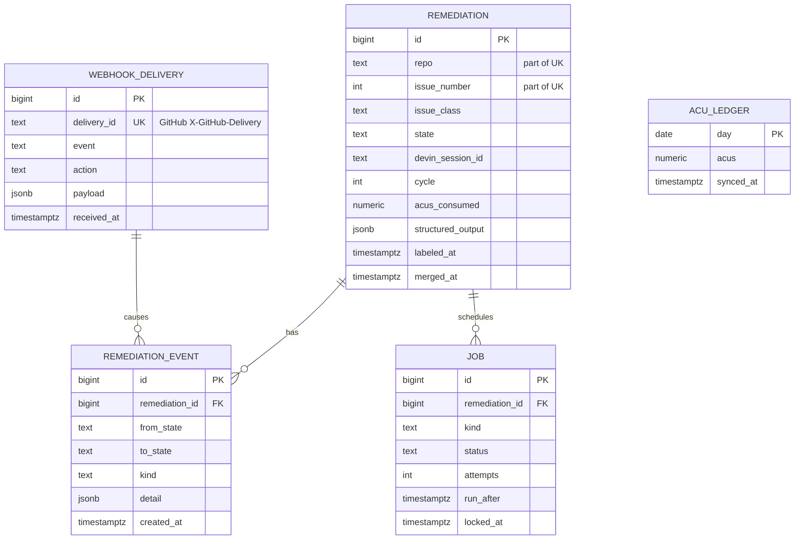

# Data model

> **Status:** Design · **Answers:** What is persisted, and what guarantees do the constraints provide?

Postgres, accessed through SQLAlchemy 2.0 with Alembic migrations. Five tables that hold the
work, and one single-row table that holds the poller's heartbeat.

## `webhook_delivery`

Raw record of everything GitHub sent us. Written before any interpretation, so a payload we failed
to handle is still on disk.

| Column | Type | Notes |
|---|---|---|
| `id` | `bigserial` PK | |
| `delivery_id` | `text` **UNIQUE NOT NULL** | GitHub's `X-GitHub-Delivery` header |
| `event` | `text NOT NULL` | `X-GitHub-Event`, e.g. `issues`, `check_suite` |
| `action` | `text` | `payload.action`, e.g. `labeled`, `completed` |
| `payload` | `jsonb NOT NULL` | Verbatim body |
| `received_at` | `timestamptz NOT NULL` | |
| `processed_at` | `timestamptz` | Null until a handler has interpreted it |
| `handler_result` | `text` | `enqueued` / `ignored` / `error` — plus the reason in `detail` |

The unique constraint on `delivery_id` is the replay defence: GitHub retries deliveries, and a
retry must not create a second session.

## `remediation`

The central aggregate: one labelled issue and everything that follows from it.

| Column | Type | Notes |
|---|---|---|
| `id` | `bigserial` PK | |
| `repo` | `text NOT NULL` | `owner/name` |
| `issue_number` | `int NOT NULL` | |
| `issue_class` | `text NOT NULL` | One of the classes in [01](./01-overview.md) |
| `state` | `text NOT NULL` | See [04](./04-state-machine.md) |
| `cycle` | `int NOT NULL DEFAULT 0` | Review-fix iterations so far |
| `devin_session_id` | `text` | `devin-…` |
| `devin_session_url` | `text` | Deep link shown on the dashboard |
| `devin_status` | `text` | Last observed Devin status: `new`/`claimed`/`running`/`exit`/`error`/`suspended`/`resuming` |
| `pr_number` | `int` | |
| `pr_url` | `text` | |
| `acus_consumed` | `numeric(10,3) NOT NULL DEFAULT 0` | Reconciled by the poller |
| `structured_output` | `jsonb` | Devin's report — schema in [05](./05-devin-integration.md) |
| `blocked_reason` | `text` | Populated on `BLOCKED` / `FAILED` |
| `human_message_count` | `int NOT NULL DEFAULT 0` | Messages a human sent into the session; drives autonomy rate |
| `labeled_at` | `timestamptz NOT NULL` | Clock starts here |
| `session_created_at` | `timestamptz` | |
| `pr_opened_at` | `timestamptz` | |
| `ci_green_at` | `timestamptz` | First successful check suite on the PR |
| `merged_at` | `timestamptz` | |
| `closed_at` | `timestamptz` | Terminal timestamp for `BLOCKED` / `FAILED` |

**`UNIQUE (repo, issue_number)`** is the idempotency guarantee. Several distinct events — a label
added twice, a comment, a re-opened issue — all resolve to the same row, so at most one Devin
session exists per issue. The worker uses `INSERT … ON CONFLICT DO NOTHING RETURNING id` to make
"create if absent" a single atomic statement.

Indexes: `(state)` for the worker's in-flight query, `(labeled_at)` for time-window analytics,
`(devin_session_id)` for poller reconciliation.

## `remediation_event`

Append-only transition log. **Never updated, never deleted.**

| Column | Type | Notes |
|---|---|---|
| `id` | `bigserial` PK | |
| `remediation_id` | `bigint NOT NULL` FK | |
| `webhook_delivery_id` | `bigint` FK | Present when a webhook caused the transition |
| `from_state` | `text` | Null for the initial event |
| `to_state` | `text NOT NULL` | |
| `kind` | `text NOT NULL` | `transition`, `devin_call`, `github_call`, `policy`, `error` |
| `detail` | `jsonb` | Devin session id, HTTP status, error message, CI failure excerpt |
| `created_at` | `timestamptz NOT NULL DEFAULT now()` | |

This table is the source of truth for every duration and rate in [07](./07-observability.md). It is
also the audit trail: stalled sessions and abandoned attempts stay visible rather than being tidied
away.

Index: `(remediation_id, created_at)`.

## `job`

The work queue. Kept in Postgres so that enqueueing and updating a remediation happen in one
transaction.

| Column | Type | Notes |
|---|---|---|
| `id` | `bigserial` PK | |
| `remediation_id` | `bigint` FK | Null for repo-wide jobs such as the vulnerability sweep |
| `kind` | `text NOT NULL` | `create_session`, `resume_session`, `escalate`, `sync_acu` |
| `payload` | `jsonb NOT NULL` | |
| `status` | `text NOT NULL` | `pending`, `running`, `done`, `failed`, `deferred` |
| `attempts` | `int NOT NULL DEFAULT 0` | |
| `run_after` | `timestamptz NOT NULL DEFAULT now()` | Backoff and deferral both write here |
| `locked_by` | `text` | Worker instance id |
| `locked_at` | `timestamptz` | Lease start; a stale lease is reclaimable |
| `last_error` | `text` | |

Claiming, and the retry policy that writes `run_after`, are specified in
[06](./06-event-pipeline.md).

Index: `(status, run_after)`.

## `acu_ledger`

Daily ACU consumption, synced from Devin's consumption API. Backs the budget guard and the cost
panel.

| Column | Type | Notes |
|---|---|---|
| `day` | `date` PK | UTC |
| `acus` | `numeric(10,3) NOT NULL` | |
| `synced_at` | `timestamptz NOT NULL` | Staleness indicator on the dashboard |

## `poller_heartbeat`

When the poller last completed a tick. One row, upserted on a fixed key.

| Column | Type | Notes |
|---|---|---|
| `id` | `integer` PK | Always `1`; the conflict target of the upsert |
| `ticked_at` | `timestamptz NOT NULL` | End of the last completed tick |

This is the only source for `poller_lag_seconds` ([07](./07-observability.md)). The transition
timestamps on `remediation` record what happened *to* a remediation, not that anybody looked at it,
and a healthy poller observing "still `RUNNING`" writes no event at all — so the age of the newest
`remediation_event` would report a remediation being polled correctly as hours behind.

A column on `remediation` would be the obvious place and is the wrong one. The poller reconciles
every in-flight remediation on every tick, so a per-row stamp writes N rows every
`POLL_INTERVAL_SECONDS` for as long as they are in flight — and their staleness is uniform anyway,
which is what lets one row speak for all of them.

## Timestamps to metrics

The columns on `remediation` exist so that the headline durations are a subtraction, not a window
function over the event log. The event log remains authoritative for anything finer-grained.

**Every funnel stage is counted from its timestamp, never from `state`.** A remediation has reached
a stage when the column exists. That is what lets `BLOCKED` with a `merged_at` — an escalation that
a human resolved by merging — count as merged in the funnel *and* still appear in the failure
breakdown, which is the truth about it in both directions. `merged_at` is stamped from any state for
exactly this reason ([04](./04-state-machine.md#invariants), invariant 1).

| Metric | Expression |
|---|---|
| Time to session | `session_created_at − labeled_at` |
| **Time to PR** | `pr_opened_at − labeled_at` |
| Time to green CI | `ci_green_at − labeled_at` |
| **Time to merge (MTTR)** | `merged_at − labeled_at` |
| Review latency | `merged_at − ci_green_at` |
| Time to escalation | `closed_at − labeled_at` where `state = BLOCKED` |
