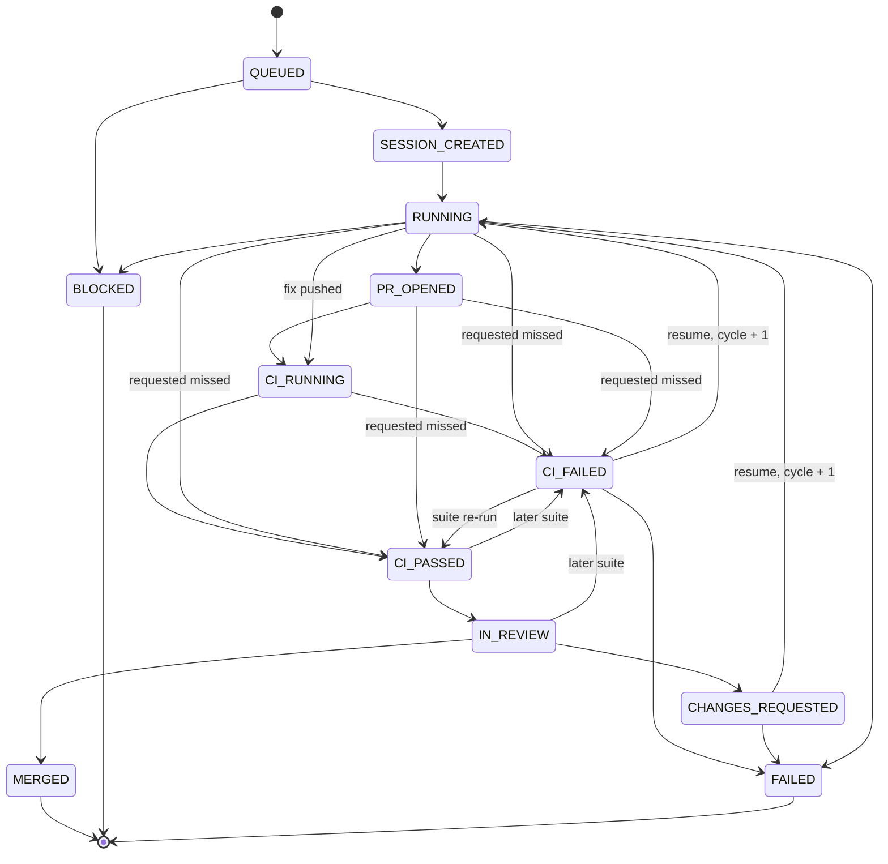
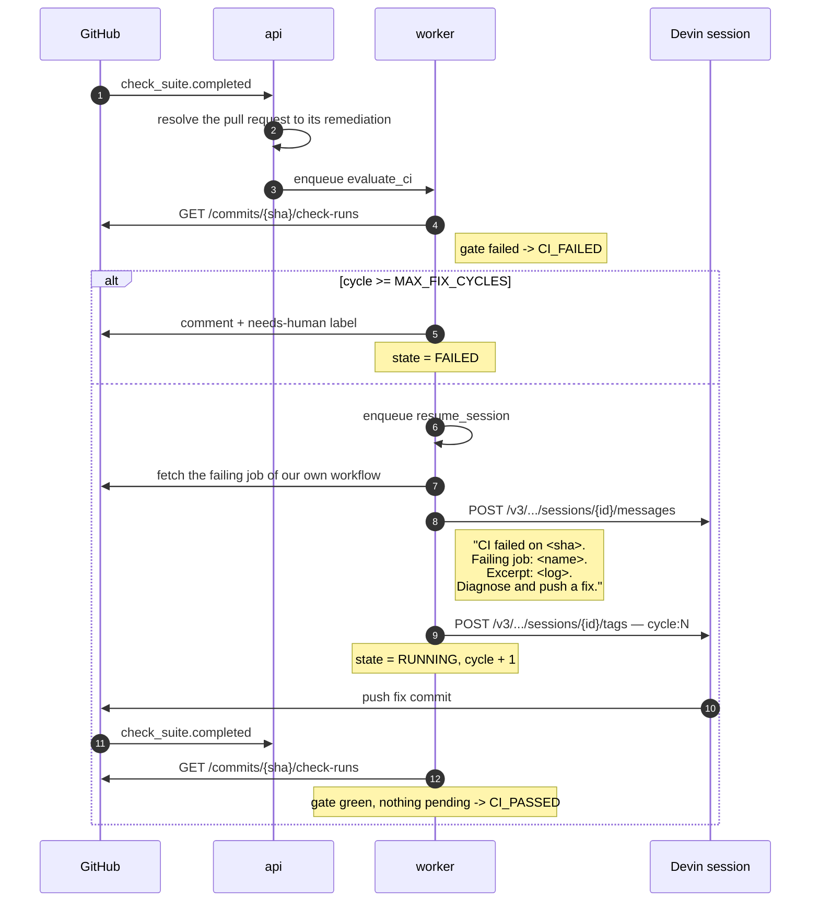

# Remediation lifecycle

> **Status:** Design · **Answers:** What states can a remediation be in, what moves it between them, and how does the review-fix loop work?

## States

| State | Meaning |
|---|---|
| `QUEUED` | Issue accepted, job enqueued, no Devin session yet |
| `SESSION_CREATED` | Devin session exists; work has not been observed starting |
| `RUNNING` | Devin is working (session status `running`/`claimed`/`resuming`) |
| `PR_OPENED` | A pull request attributable to this remediation exists |
| `CI_RUNNING` | A check suite is in progress on the head SHA |
| `CI_FAILED` | The check suite failed — the loop trigger |
| `CI_PASSED` | All required checks green |
| `IN_REVIEW` | Awaiting human review |
| `CHANGES_REQUESTED` | A reviewer requested changes — the second loop trigger |
| `MERGED` | **Terminal, success.** |
| `BLOCKED` | **Terminal.** Devin reported it cannot proceed, or a policy limit stopped us. Escalated to a human. |
| `FAILED` | **Terminal.** The session errored, spent its ACU cap, or finished without a pull request; or the cycle limit was exhausted. |

## Transitions

| From | To | Trigger | Side effects |
|---|---|---|---|
| — | `QUEUED` | `issues.labeled` with `devin:autofix` | Create `remediation`, enqueue `create_session` |
| `QUEUED` | `SESSION_CREATED` | Worker created the session | `POST /v3/…/sessions`; store `devin_session_id`, `session_created_at` |
| `QUEUED` | `BLOCKED` | Daily ACU budget exhausted, or issue class unrecognised | Comment on issue, add `needs-human` |
| `SESSION_CREATED` | `RUNNING` | Poller sees any status but `new` — the session has been claimed. A session first observed at `exit` still passes through here, because invariant 5 puts `PR_OPENED` on every path to CI and `RUNNING` is the only state it is reachable from | — |
| `RUNNING` | `PR_OPENED` | `pull_requests[]` on the session, observed by the poller — **only while no pull request is linked**. The `pull_request.opened` webhook carries no key that can find its remediation and is dropped ([ADR](./adr/2026-08-08-the-poller-links-the-pull-request.md)) | Link PR to remediation, set `pr_opened_at`. Write-once: a later observation is recorded and otherwise ignored ([ADR](./adr/2026-08-08-the-poller-records-only-what-moves.md)) |
| `PR_OPENED`, `RUNNING` | `CI_RUNNING` | `check_suite.requested`, or a **pending** verdict — **requires a linked pull request** | — |
| `PR_OPENED`, `RUNNING`, `CI_RUNNING`, `CI_FAILED` | `CI_PASSED` | A **green** verdict over the head SHA's check runs — **requires a linked pull request** | Set `ci_green_at` |
| `PR_OPENED`, `RUNNING`, `CI_RUNNING`, `CI_PASSED`, `IN_REVIEW` | `CI_FAILED` | A **failed** verdict — the gate check run failed — **requires a linked pull request** | Enqueue `resume_session` |
| **`CI_FAILED`** | **`RUNNING`** | Worker resumed the session | Fetch failing job logs, `POST /v3/…/messages`, increment `cycle`, append tag `cycle:N` |
| `CI_PASSED` | `IN_REVIEW` | Entering `CI_PASSED` | Request review; post the structured-output summary as a PR comment |
| `IN_REVIEW` | `CHANGES_REQUESTED` | `pull_request_review.submitted`, state `changes_requested` | Enqueue `resume_session` |
| **`CHANGES_REQUESTED`** | **`RUNNING`** | Worker resumed the session | Forward review body and inline comments via `POST /v3/…/messages`, increment `cycle` |
| `IN_REVIEW` | `MERGED` | `pull_request.closed` with `merged: true` | Set `merged_at`, append tag `outcome:merged`, close the issue |
| any | `BLOCKED` | `structured_output.outcome == "blocked"`, or a session Devin reports as `running` and stalled on `status_detail: waiting_for_user` ([ADR](./adr/2026-08-08-a-stalled-session-is-blocked.md)) | Store `blocked_reason`, comment on issue, add `needs-human` |
| any | `FAILED` | Session status `error`; `cycle > MAX_FIX_CYCLES`; or, **while no pull request is linked**, `acus_consumed` reaching `ACU_CAPS[issue_class]` or Devin finishing the session with nothing to show ([ADR](./adr/2026-08-08-a-session-with-nothing-to-show-fails.md)) | Store reason, comment on issue, add `needs-human` |

## What "CI green" means

**A check suite conclusion is not the CI verdict.** GitHub raises one check suite per app and per
workflow, and `taxpon/superset` carries 46 of them, so "a suite succeeded" means one workflow
succeeded and says nothing about the other 45. Nor can a delivery be filtered down to our own suite:
the `check_suite` payload carries no workflow name, and `app.slug` is `github-actions` for every
Actions workflow alike.

The verdict is read from **every check run on the pull request's head SHA at once**
(`GET /repos/{repo}/commits/{sha}/check-runs`), gated on the check run named by
`CI_REQUIRED_CHECK_NAME` — `devin-autofix-ci`, the `if: always()` conclusion job of
[`fork-ci/devin-autofix-ci.yml`](./fork-ci/devin-autofix-ci.yml), which already fails when any
scoped signal did.

| Verdict | When | Trigger applied |
|---|---|---|
| **failed** | the gate check run failed, whatever else is still running | `check_suite_failed` |
| **green** | the gate succeeded, nothing else is failing, nothing is incomplete | `check_suite_succeeded` |
| **pending** | anything else — including an absent gate, and a failure *outside* our workflow | `check_suite_requested` |

Three consequences worth stating:

- **A failing check outside our own workflow yields pending, not failed.** It has not judged the
  diff. The fork's `Dependency Review` fails on every pull request there because the repository has
  no dependency graph enabled, and resuming a session over it spends a fix cycle on something no
  diff can change. It does hold the pull request out of `CI_PASSED` indefinitely, which is the cost;
  [B2](./blockers.md#b2) is what removes the cause, and the worker logs the names so the wait is
  never mysterious.
- **The gate failing is reported immediately**, without waiting for the rest of the SHA. A failure
  the session can act on is news now; making the loop wait for an unrelated Cypress shard is latency
  spent on nothing.
- **`CI_RUNNING` now means "the head SHA has checks outstanding"**, reached both by a
  `check_suite.requested` delivery and by a pending verdict.

Recorded in [ADR](./adr/2026-08-10-ci-green-is-the-aggregate-of-the-check-runs.md).

### Where the verdict is reached

Not on the ingress path, which makes no outbound call
([ADR](./adr/2026-08-07-respond-202-before-external-calls.md)). Every `check_suite.completed`
delivery — **whatever it concluded**, including `cancelled` and `skipped`, because the completion
that finally settles a SHA may well be one of those — resolves its remediation and enqueues an
`evaluate_ci` job. The worker reads the pull request's current head, then the check runs on it, and
applies the trigger the verdict names.

The head SHA comes from the pull request rather than from the job payload: a payload SHA can be
stale by the time the job is claimed, and a superseded run's checks are `cancelled`, which is
complete-and-not-failing — the exact shape an "all clear" rule reads as green.

An evaluation that moves nothing writes no `remediation_event`, on the rule the poller already
follows ([ADR](./adr/2026-08-08-the-poller-records-only-what-moves.md)): 18 suites concluded on the
first live remediation, and re-reading one SHA 18 times is not 18 facts. The deliveries themselves
remain in `webhook_delivery`.

## Check suite events

Sentinel does not choose when a check suite reports, so a `check_suite` event can arrive in **any**
state that can hold a linked pull request: `PR_OPENED`, `RUNNING`, `CI_RUNNING`, `CI_FAILED`,
`CI_PASSED`, `IN_REVIEW`, `CHANGES_REQUESTED`. None of them may reject one. Where the verdict is one
the state already carries, it is absorbed — the same treatment a terminal state gives a late
webhook.

| Trigger | Moves from | Absorbed from |
|---|---|---|
| `check_suite_requested` — a pending verdict, or a `check_suite.requested` delivery | `PR_OPENED`, `RUNNING` | `CI_RUNNING`, `CI_FAILED`, `CI_PASSED`, `IN_REVIEW`, `CHANGES_REQUESTED` |
| `check_suite_succeeded` — a green verdict | `PR_OPENED`, `RUNNING`, `CI_RUNNING`, `CI_FAILED` | `CI_PASSED`, `IN_REVIEW`, `CHANGES_REQUESTED` |
| `check_suite_failed` — a failed verdict | `PR_OPENED`, `RUNNING`, `CI_RUNNING`, `CI_PASSED`, `IN_REVIEW` | `CI_FAILED`, `CHANGES_REQUESTED` |

Reading the rows:

- **`PR_OPENED` moves on a verdict.** This is the ordinary first lap, not an edge case. The poller
  is what links the pull request ([ADR](./adr/2026-08-07-poller-drives-state-machine.md)), and it
  does so up to `POLL_INTERVAL_SECONDS` after the pull request appeared — routinely after the first
  `check_suite.requested` has already been dropped as unresolvable. The remediation is therefore
  sitting in `PR_OPENED`, not `CI_RUNNING`, when the first evaluation lands.
- **A suite starting again is never news.** Pulling a remediation out of review, or out of the fix
  loop, to record that CI restarted would lose the state that matters. The verdict follows.
- **A second green is absorbed.** `ci_green_at` is the *first* green verdict
  ([03](./03-data-model.md)), and a later one must not drag a remediation back out of review.
- **A failure is news almost everywhere**, including `IN_REVIEW`, where nothing else would re-engage
  the fix loop. Not in `CHANGES_REQUESTED`, which already has a `resume_session` pending that will
  produce a fresh suite of its own, and not twice over in `CI_FAILED`.

## The review-fix loop

The two loop edges — `CI_FAILED → RUNNING` and `CHANGES_REQUESTED → RUNNING` — are the substance of
the system. They reuse the **existing** session (`resumable: true`) so Devin retains the context of
its own change instead of rediscovering it.

The CI states are re-entered from `RUNNING` on the second and later passes round the loop: the pull
request already exists, so the check suite for the fix commit is observed while the session is
running. That is one case of the general rule above — a conclusion is accepted wherever a linked
pull request can sit.

The widening is bounded by the pull request itself, not by the lap count, because both halves of
the condition have to hold. A check suite is only meaningful once a pull request is linked, so the
CI triggers require one — which keeps `PR_OPENED` on every path into the CI states rather than
letting `RUNNING → CI_PASSED` bypass it. And `RUNNING → PR_OPENED` is only legal while none is
linked, so the poller, which re-reads `pull_requests[]` on every poll
([ADR](./adr/2026-08-07-poller-drives-state-machine.md)), cannot walk the state backwards out of the
loop or re-stamp `pr_opened_at` on lap two. A repeat observation is absorbed rather than rejected,
exactly as for a terminal state — but the poller does not record it: a webhook arrives once per real
event, while the poller re-reads the same session every `POLL_INTERVAL_SECONDS`, so only the
observations that move a remediation are written to `remediation_event`
([ADR](./adr/2026-08-08-the-poller-records-only-what-moves.md)).

The message states the failure and the goal; it does not prescribe the fix. Steering Devin
line-by-line would defeat the purpose and is explicitly avoided ([05](./05-devin-integration.md)).

## Invariants

1. **Terminal states are absorbing — for work, not for observation.** No transition leaves `MERGED`,
   `BLOCKED` or `FAILED`, and a webhook arriving after one is recorded and otherwise ignored: in
   `remediation_event` where it carried a trigger, and in `webhook_delivery` alone where it did not.
   A `check_suite.completed` after a merge is the second kind — it asks for an evaluation rather
   than carrying a verdict, and a terminal remediation is not evaluated at all.

   **`merged_at` is the exception, and is stamped from any state.** A merge is a fact about the pull
   request rather than a state the remediation entered, and the two come apart whenever a human
   resolves an escalation by merging: `PR_MERGED` is legal only from `IN_REVIEW`, so a `BLOCKED`
   remediation absorbs it. Remediation 1 ended exactly there — its last event is
   `BLOCKED -> BLOCKED pr_merged`, `merged_at` stayed null, and the funnel read `merged: 0` beside a
   link to a pull request GitHub shows as merged. **No row may contradict the pull request it links
   to**, so the column is written whether or not the state moves.

   The state is deliberately left alone. Flattening `BLOCKED` to `MERGED` would erase the
   escalation, which also happened, and the failure breakdown in [07](./07-observability.md) would
   lose the row that a human's involvement is the whole point of. `BLOCKED` with a `merged_at` is
   not a contradiction — it is what "escalated, and then a person merged it" looks like.
2. **One session per remediation.** Guaranteed by `UNIQUE (repo, issue_number)` plus
   `INSERT … ON CONFLICT DO NOTHING` ([03](./03-data-model.md)).
3. **`cycle` only increases,** and only on a transition into `RUNNING` from `CI_FAILED` or
   `CHANGES_REQUESTED`. `cycle > MAX_FIX_CYCLES` forces `FAILED`.
4. **Every transition writes exactly one `remediation_event`,** in the same transaction as the
   state column update. The log can never disagree with the column.
5. **A pull request is linked exactly once, and `PR_OPENED` is on every path to CI.** `pr_number`,
   `pr_url` and `pr_opened_at` are written when `PR_OPENED` is entered and never again. No sequence
   of triggers reaches `CI_RUNNING`, `CI_PASSED`, `CI_FAILED`, `IN_REVIEW`, `CHANGES_REQUESTED` or
   `MERGED` without passing through it. The funnel, the merge rate `merged / pr_opened` and
   time-to-PR in [07](./07-observability.md) all rest on this.
6. **Illegal transitions raise** rather than silently no-op, and are asserted in the test matrix
   ([08](./08-testing.md)).

## Escalation

`BLOCKED` and `FAILED` both escalate rather than terminate quietly:

- a comment on the originating issue containing Devin's `blocked_reason` or the policy reason, plus
  a link to the session;
- the `needs-human` label;
- the remediation stays visible on the dashboard's failure-breakdown panel
  ([07](./07-observability.md)).

Escalated work is **not** deleted or retried automatically. An unresolved item is a real signal
about the system's limits and is reported as such.
