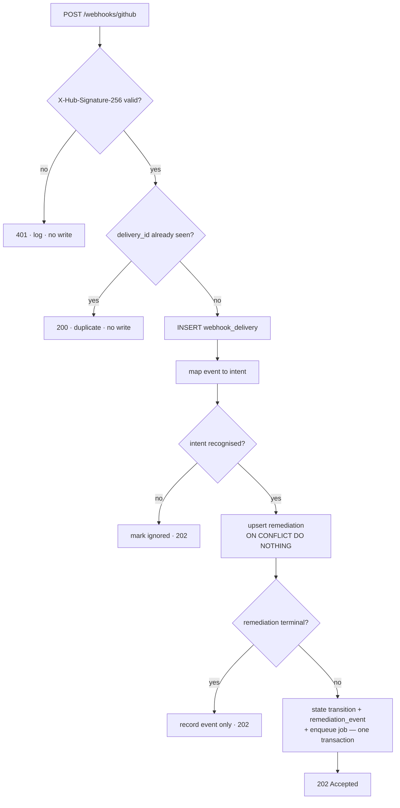

# Event pipeline

> **Status:** Design · **Answers:** How are webhooks authenticated, deduplicated, queued and retried?

## Subscribed events

A single GitHub webhook on `taxpon/superset` delivering to `POST /webhooks/github`.

| Event | Action | Intent |
|---|---|---|
| `issues` | `labeled` (label `devin:autofix`) | **Start a remediation** |
| `issues` | `unlabeled`, `closed` | Cancel if not yet terminal: `FAILED`, with the reason in `remediation.blocked_reason` ([ADR](./adr/2026-08-08-cancellation-is-recorded-as-failed.md)) |
| `pull_request` | `opened` | Nothing — the poller links the PR ([ADR](./adr/2026-08-08-the-poller-links-the-pull-request.md)) |
| `pull_request` | `closed` (`merged: true`) | `MERGED` |
| `pull_request` | `closed` (`merged: false`) | `FAILED` — abandoned |
| `pull_request_review` | `submitted`, state `changes_requested` | **Resume the session** with the review |
| `pull_request_review` | `submitted`, state `approved` | Record review latency |
| `check_suite` | `requested` | `CI_RUNNING` |
| `check_suite` | `completed`, **any** conclusion | Enqueue `evaluate_ci`. The conclusion is one of the fork's 46 workflows talking and is not the CI verdict ([04](./04-state-machine.md#what-ci-green-means)) |
| `issue_comment` | `created` | If it mentions the bot, forward to the session and count as human intervention |
| `ping` | — | Acknowledge, take no action |

Anything else is stored in `webhook_delivery` with `handler_result = ignored` and dropped. Unknown
events are never an error.

**Which remediation a delivery is about.** `remediation` is keyed `(repo, issue_number)`, and
`pr_number` is null until `PR_OPENED` has been applied. So an `issues` or `issue_comment` delivery
is resolved by issue number, and everything about a pull request — `closed`, a review, a check
suite — by `pr_number`, which is populated by the time any of them can arrive. GitHub delivers a
pull request's conversation as `issue_comment` with `issue.number` holding the *pull request*
number and `issue.pull_request` present to say so; that one resolves by `pr_number` too.

`pull_request.opened` is the exception, and the reason it does nothing here: it is the event that
would establish the link, so no key exists yet to resolve it by.

## Ingress path



No call to Devin or GitHub happens on this path. The request does signature verification, a handful
of writes in one transaction, and returns — well inside GitHub's 10-second delivery timeout.

## Signature verification

GitHub signs the raw body with the shared secret. Sentinel verifies before parsing anything.

- Header: `X-Hub-Signature-256`, value `sha256=<hex>`.
- Compute `HMAC-SHA256(secret, raw_body)` over the **raw bytes**, before JSON decoding — re-encoding
  changes the digest.
- Compare with `hmac.compare_digest`. Never `==`.
- Missing header, malformed prefix, or mismatch → `401`, nothing written, the failure logged with
  the source IP and delivery id.
- Bodies above 5 MB are rejected with `413` before hashing.

Verification is a pure function (`sentinel.security.hmac.verify_signature`) so it can be tested
directly against known vectors ([08](./08-testing.md)).

## Deduplication

Three independent layers, because they defend against different things.

| Layer | Key | Defends against |
|---|---|---|
| **Delivery** | `webhook_delivery.delivery_id` UNIQUE | GitHub retrying a delivery; a replayed request |
| **Domain** | `remediation (repo, issue_number)` UNIQUE | Two *different* events about the same issue — label removed and re-added, issue reopened — opening a second remediation |
| **Session** | The `sentinel`, `repo:<r>` and `issue:<n>` tags on the Devin session itself | One remediation's `create_session` job being *run* more than once — a client retry, a reclaimed lease, or a job retried after a `POST` whose response was lost ([05](./05-devin-integration.md#adopt-or-create)) |

The first two are enforced by the database rather than by application-level checks, so they hold
under concurrent workers. A duplicate delivery returns `200` with a `duplicate` body: an error would
make GitHub retry it forever.

The third cannot be, because the row it would have to be unique on lives at Devin and the v3 create
endpoint takes no idempotency key. It is enforced by asking instead: `create_session` lists sessions
carrying those three tags and adopts one rather than creating a second. It exists because the first
two layers stop a second *remediation* and say nothing about a second *session* for one remediation
— which is what happened on 2026-08-11, when nine sessions were created for three issues.

## Jobs and claiming

Workers claim jobs with a single statement, so multiple workers are safe without a lock service:

```sql
UPDATE job SET status = 'running', locked_by = :worker_id, locked_at = now()
WHERE id = (
    SELECT id FROM job
    WHERE status = 'pending' AND run_after <= now()
    ORDER BY run_after
    FOR UPDATE SKIP LOCKED
    LIMIT 1
)
RETURNING *;
```

A lease older than `JOB_LEASE_TIMEOUT` (default 15 min) is reclaimable, so a worker killed
mid-job does not strand its work.

| Job kind | Does |
|---|---|
| `create_session` | Policy checks, then `POST /v3/…/sessions` |
| `resume_session` | Gather CI logs or review comments, then `POST /v3/…/messages` |
| `escalate` | Comment on the issue, apply `needs-human` |
| `sync_acu` | Refresh `acu_ledger` from the consumption API |
| `evaluate_ci` | Read every check run on the pull request's head, and apply the verdict |

## Reliability policy

| Concern | Policy |
|---|---|
| **Retry** | On `429`/`5xx` or a network error: `attempts += 1`, `run_after = now() + 2^attempts × 5 s` with jitter, capped at 10 min. `MAX_JOB_ATTEMPTS` (default 5) then transitions the remediation to `FAILED`. This is the layer that makes an idempotent `create_session` necessary rather than optional: it re-runs the handler, and therefore the `POST`, long after the client's own retries are spent. |
| **Non-retryable** | `4xx` other than `429` fails immediately; retrying a validation error only wastes quota. Response body recorded in `remediation_event.detail`. |
| **Concurrency** | Before creating a session, count remediations in `SESSION_CREATED`/`RUNNING`. At or above `MAX_CONCURRENT_SESSIONS` (default 3), the job is `deferred` with `run_after = now() + 60 s`. Deferral is not an attempt and does not consume the retry budget. |
| **ACU budget** | Before creating a session, compare today's `acu_ledger` total plus the class cap against `DAILY_ACU_BUDGET`. Over budget → `BLOCKED` with reason `daily_acu_budget_exhausted`, escalated to a human. A cost ceiling should be visible, not silent. |
| **Per-session cap** | `max_acu_limit` per class ([05](./05-devin-integration.md)) — a second ceiling enforced by Devin itself. |
| **Cycle limit** | `cycle > MAX_FIX_CYCLES` (default 3) → `FAILED`. Stops an agent looping on a failure it cannot resolve. |
| **Poller reconciliation** | Independent of webhooks. If a webhook is missed entirely, the poller still observes the session reaching `exit` and the PR appearing in `pull_requests[]`, so the pipeline is self-healing. |

## Correlation

The GitHub delivery id is the correlation id end to end: it is the `run:<delivery_id>` Devin tag, a
field on every structured log line, and a column on `remediation_event`. Given a session in the
Devin dashboard, the full Sentinel history is one query away — and vice versa.
