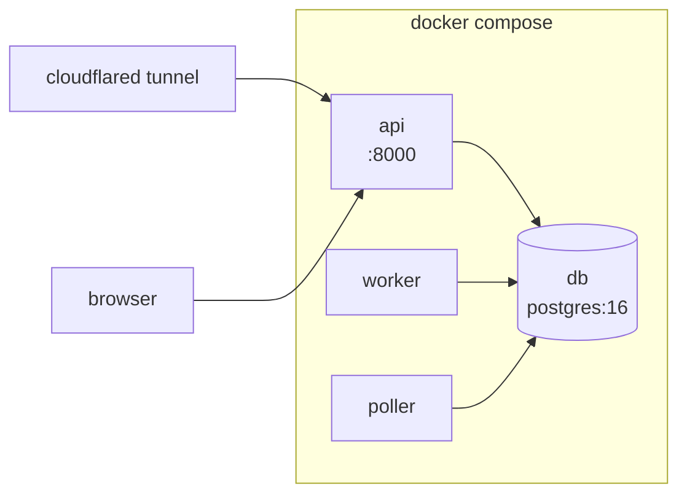

# Operations

> **Status:** Design · **Answers:** How do I configure, bootstrap, run and demonstrate the system?

## Prerequisites

| Requirement | Notes |
|---|---|
| Devin organisation | `org_id` (`org-…`) and a service-user token (`cog_…`) with `ManageOrgSessions` |
| GitHub fine-grained PAT | Scoped to `taxpon/superset`: issues read/write, pull requests read/write, contents read |
| Docker + Compose | |
| `cloudflared` or `ngrok` | A publicly reachable URL for webhook delivery |
| Node 20+ | Only to build `dashboard/` |

## Configuration

All configuration is environment variables, loaded via `pydantic-settings`. `.env.example` is the
canonical list.

| Variable | Required | Default | Purpose |
|---|---|---|---|
| `DEVIN_API_BASE` | | `https://api.devin.ai` | |
| `DEVIN_API_TOKEN` | ✓ | | Service-user token (`cog_` prefix) |
| `DEVIN_ORG_ID` | ✓ | | `org-…` |
| `DEVIN_ENTERPRISE_ID` | | | Enables the enterprise metrics panel; omit to use the fallback |
| `DEVIN_PLAYBOOK_IDS` | ✓ | | JSON map of issue class → playbook id; a playbook name is also accepted as the key, so four entries suffice for the eight classes ([ADR](./adr/2026-08-08-playbook-ids-keyed-by-class-or-name.md)) |
| `DEVIN_KNOWLEDGE_IDS` | | | JSON array, written by the bootstrap script |
| `GITHUB_TOKEN` | ✓ | | Fine-grained PAT |
| `GITHUB_WEBHOOK_SECRET` | ✓ | | Shared secret for HMAC verification |
| `TARGET_REPO` | | `taxpon/superset` | |
| `TARGET_BASE_BRANCH` | | `master` | The fork's default branch is `master`, not `main` |
| `AUTOFIX_LABEL` | | `devin:autofix` | Trigger label |
| `DATABASE_URL` | ✓ | | `postgresql+asyncpg://…` |
| `MAX_CONCURRENT_SESSIONS` | | `3` | In-flight session cap |
| `DAILY_ACU_BUDGET` | | `100` | Hard daily spend ceiling |
| `MAX_FIX_CYCLES` | | `3` | Review-fix iterations before `FAILED` |
| `MAX_JOB_ATTEMPTS` | | `5` | Retries before the remediation fails |
| `JOB_LEASE_TIMEOUT_SECONDS` | | `900` | Stale-lease reclaim window |
| `POLL_INTERVAL_SECONDS` | | `20` | Devin reconciliation cadence |
| `ACU_UNIT_COST_USD` | | `2.25` | **Set from your own contract** — it only scales the cost panel |
| `LOG_LEVEL` | | `info` | |

## Topology



`api`, `worker` and `poller` share one image and differ only by command. `dashboard/` is built at
image build time and served statically by `api`; that build stage is added by T30, so until then the
image serves the API alone.

```bash
cp .env.example .env      # fill in the required values
docker compose up -d
docker compose run --rm api alembic upgrade head
```

## Bootstrap

One-time setup, scripted as `make bootstrap`. Each step is idempotent.

### 1. Target repository

```bash
# Issues are disabled on a fresh fork, and the trigger depends on them
gh api -X PATCH repos/taxpon/superset -F has_issues=true

gh label create 'devin:autofix'  -R taxpon/superset -c '#0e8a16' -d 'Sentinel: remediate automatically'
gh label create 'needs-human'    -R taxpon/superset -c '#d93f0b' -d 'Sentinel: escalated'
for c in security security-dep bug frontend-dep flaky-test deprecation typing perf; do
  gh label create "class:$c" -R taxpon/superset -c '#5319e7'
done
```

Then add `.github/workflows/devin-autofix-ci.yml` to the fork ([08](./08-testing.md)). Workflows on
a fork are not registered until the first run, so open one throwaway pull request to activate them
before relying on CI ([B2](./blockers.md)).

### 2. Devin organisation

```bash
make bootstrap-devin
```

- registers the tag vocabulary via `PUT /v3/organizations/{org}/tags` ([05](./05-devin-integration.md));
- creates the four knowledge notes and writes their ids into `.env`;
- creates the nightly sweep schedule;
- verifies the token by listing sessions, and reports which optional enterprise endpoints are
  reachable so the degradation path is known before the demo, not during it.

### 3. Webhook

```bash
cloudflared tunnel --url http://localhost:8000     # note the generated https URL

gh api -X POST repos/taxpon/superset/hooks \
  -f "config[url]=$TUNNEL_URL/webhooks/github" \
  -f "config[secret]=$GITHUB_WEBHOOK_SECRET" \
  -f "config[content_type]=json" \
  -f 'events[]=issues' -f 'events[]=pull_request' \
  -f 'events[]=pull_request_review' -f 'events[]=check_suite' \
  -f 'events[]=issue_comment'
```

A free tunnel URL changes on every restart. If the tunnel is restarted, update the hook's
`config[url]` — a stale URL shows up as failed deliveries in the repository's webhook settings, and
GitHub will redeliver them once the URL is fixed.

## Demo runbook

```bash
# 0. Preflight — all green before starting
curl -s localhost:8000/healthz | jq
gh api repos/taxpon/superset/hooks --jq '.[].last_response.status'   # expect "active"

# 1. Trigger a live remediation
gh issue edit <n> -R taxpon/superset --add-label devin:autofix
#    dashboard: QUEUED -> SESSION_CREATED -> RUNNING within ~20s

# 2. Show the audit trail matches
#    Devin dashboard: the session's tags (sentinel, issue:<n>, class:<c>, run:<delivery>)
#    and prompt are exactly what Sentinel logged
docker compose logs api | grep '"event":"devin.session.created"' | tail -1 | jq

# 3. Show the review-fix loop  (the part worth watching)
#    push a deliberately failing commit to the PR branch, or submit a review
#    requesting changes; the same session is resumed with cycle:1 and self-corrects

# 4. Merge, then show the metrics move
curl -s 'localhost:8000/api/analytics/summary?window=7d' | jq '.funnel, .rates, .cost'

# 5. Show what did not work
#    the failure-breakdown panel, and the open items in docs/blockers.md
```

Step 5 is not optional. Unresolved and stalled work stays visible by design
([04](./04-state-machine.md)).

## Troubleshooting

| Symptom | Cause | Action |
|---|---|---|
| Webhook deliveries show `401` | Secret mismatch, or a proxy re-encoded the body | Confirm `GITHUB_WEBHOOK_SECRET`; verification runs on raw bytes, so any body rewriting breaks it |
| Deliveries succeed, nothing happens | Label name mismatch, or the event was mapped to `ignored` | `select event, action, handler_result from webhook_delivery order by id desc limit 10;` |
| Sessions created but state never advances | Poller is down, or the session is `waiting_for_user` | `docker compose logs poller`; check `status_detail` on the session |
| Jobs stuck in `deferred` | Concurrency cap or ACU budget | `select kind, status, count(*) from job group by 1,2;`, then check `acu_ledger` |
| `422` creating a session | Tag not registered in the organisation vocabulary | Re-run `make bootstrap-devin` ([B7](./blockers.md)) |
| Cost panel labelled `derived` | Enterprise metrics endpoint unavailable | Expected without enterprise scope ([B5](./blockers.md)) — the figure is computed locally |

## Before making the repository public

- `requirements/` and `CLAUDE.local.md` are git-ignored; confirm they are absent from the **entire
  history**, not just the working tree.
- No token, PAT or webhook secret in any commit — `.env` must never have been added.
- `docs/blockers.md` is current ([B12](./blockers.md), [B13](./blockers.md)).
