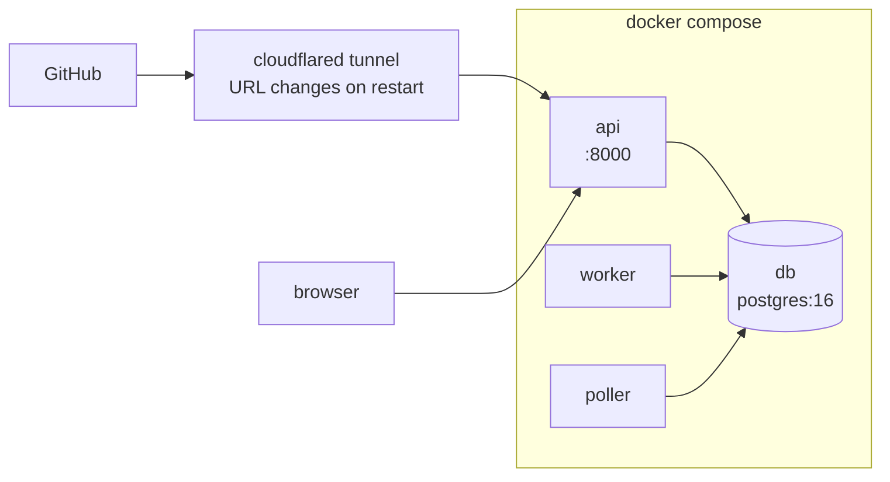
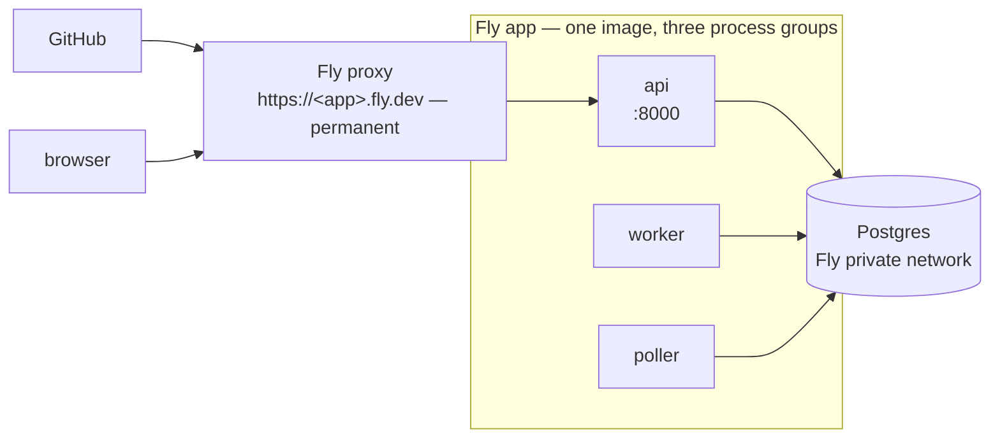

# Operations

> **Status:** Design · **Answers:** How do I configure, bootstrap, run and demonstrate the system?

## Prerequisites

| Requirement | Notes |
|---|---|
| Devin organisation | `org_id` (`org-…`) and a service-user token (`cog_…`) with `ManageOrgSessions` |
| GitHub fine-grained PAT | **Sentinel's own credential.** Scoped to `taxpon/superset`: issues read/write, pull requests read/write, contents read |
| Devin's access to `taxpon/superset` | **A separate thing, and not the PAT above.** Devin clones, pushes a branch and opens the pull request under its own GitHub connection — arranged in Devin's settings, not from this repository and not by any Sentinel credential ([B15](./blockers.md#b15)) |
| Docker + Compose | Running locally |
| `cloudflared` or `ngrok` | **Local runs only.** A publicly reachable URL for webhook delivery. A Fly deployment has a permanent one and needs neither ([Deployment](#deployment-flyio)) |
| `flyctl` | **Deployed runs only.** Not needed to run locally |
| Node 20+ | Only to build `dashboard/` |

The two columns of "only" are the whole choice: run it on a laptop behind a tunnel, or deploy it and
have a hostname that does not move. Everything else — the credentials, the labels, the Devin
bootstrap — is the same either way.

## Configuration

All configuration is environment variables, loaded via `pydantic-settings`. `.env.example` is the
canonical list.

| Variable | Required | Default | Purpose |
|---|---|---|---|
| `DEVIN_API_BASE` | | `https://api.devin.ai` | |
| `DEVIN_API_TOKEN` | ✓ | | Service-user token (`cog_` prefix) |
| `DEVIN_ORG_ID` | ✓ | | `org-…` |
| `DEVIN_ENTERPRISE_ID` | | | Enables the enterprise metrics panel; omit to use the fallback |
| `DEVIN_PLAYBOOK_IDS` | ✓ | | JSON map of issue class → playbook id; a playbook name is also accepted as the key, so four entries suffice for the eight classes ([ADR](./adr/2026-08-08-playbook-ids-keyed-by-class-or-name.md)) |
| `DEVIN_KNOWLEDGE_IDS` | | | JSON array, written by the bootstrap script |
| `GITHUB_TOKEN` | ✓ | | Fine-grained PAT |
| `GITHUB_WEBHOOK_SECRET` | ✓ | | Shared secret for HMAC verification |
| `TARGET_REPO` | | `taxpon/superset` | |
| `TARGET_BASE_BRANCH` | | `master` | The fork's default branch is `master`, not `main` |
| `AUTOFIX_LABEL` | | `devin:autofix` | Trigger label |
| `CI_REQUIRED_CHECK_NAME` | | `devin-autofix-ci` | The check run that decides CI green — the conclusion job of the fork's own workflow |
| `CI_WORKFLOW_PATH` | | `.github/workflows/devin-autofix-ci.yml` | Which workflow's log a resume message quotes |
| `DATABASE_URL` | ✓ | | `postgresql+asyncpg://…`. A provider's `postgres://` or `postgresql://` is accepted and the driver applied ([ADR](./adr/2026-08-10-the-asyncpg-driver-is-applied-not-demanded.md)); a URL naming a different driver is rejected at startup. A libpq query string is adapted too — `sslmode` is renamed to asyncpg's `ssl`, and a parameter asyncpg cannot take is rejected by name ([details](#2-postgres)) |
| `MAX_CONCURRENT_SESSIONS` | | `3` | In-flight session cap |
| `DAILY_ACU_BUDGET` | | `100` | Hard daily spend ceiling |
| `MAX_FIX_CYCLES` | | `3` | Review-fix iterations before `FAILED` |
| `MAX_JOB_ATTEMPTS` | | `5` | Retries before the remediation fails |
| `JOB_LEASE_TIMEOUT_SECONDS` | | `900` | Stale-lease reclaim window |
| `POLL_INTERVAL_SECONDS` | | `20` | Devin reconciliation cadence |
| `LOG_LEVEL` | | `info` | |

`api`, `worker` and `poller` read all of it: one required variable missing and the process refuses
to start, before it has accepted a delivery or claimed a job.

The scripts do not. Each declares the group of variables it actually reads and is told about only
those, so the repository can be prepared before Devin or the database exists — and a dry run, which
writes nothing, needs no more than it takes to read
([ADR](./adr/2026-08-10-a-script-loads-the-configuration-group-it-reads.md)):

- `make bootstrap-github` — `GITHUB_TOKEN`, `GITHUB_WEBHOOK_SECRET` (the value it gives the hook);
- `uv run scripts/bootstrap_github.py --dry-run` — `GITHUB_TOKEN`;
- `uv run scripts/file_remediation_issues.py`, with or without `--apply` — `GITHUB_TOKEN`;
- `make bootstrap-devin`, and `scripts/bootstrap_devin.py --dry-run` — `DEVIN_API_TOKEN`,
  `DEVIN_ORG_ID`, `DEVIN_PLAYBOOK_IDS`. The preview reads the same group as the run rather than a
  smaller one: it verifies the token, probes the optional endpoints and counts the playbook ids,
  which are the reads that make a preview worth having;
- `make devin-playbooks` — `DEVIN_API_TOKEN`, `DEVIN_ORG_ID`, and deliberately not
  `DEVIN_PLAYBOOK_IDS`: this is the read that *finds* it, and demanding it first would make the
  lookup unusable at the one moment anyone wants it
  ([ADR](./adr/2026-08-10-playbook-ids-are-read-back-from-the-organisation-scoped-listing.md)).

Nothing else about a script's configuration differs: the optional variables of those groups take
the defaults documented above, `.env` is read exactly as a service reads it, and a variable of the
group that is missing produces the same error naming it.

## Topology

`api`, `worker` and `poller` share one image and differ only by command. `dashboard/` is built at
image build time and served statically by `api`; that build stage is added by T30, so until then the
image serves the API alone.

That shape is what both targets below have in common. What differs is only how GitHub reaches `api`
and where Postgres lives.

### Local — Docker Compose



```bash
cp .env.example .env      # fill in the required values
docker compose up -d
docker compose run --rm api alembic upgrade head
```

### Deployed — Fly.io



No tunnel. The hostname is issued with the app and does not change, so the webhook is registered
once. Setting it up is [Deployment](#deployment-flyio) below.

## Deployment (Fly.io)

> **Verification status.** `flyctl` was not installed on the machine this section was written on, so
> **no command below has been run**. They are written from documentation and prior knowledge of the
> CLI, and the platform's behaviour and its Postgres product have both changed more than once. Treat
> every `fly …` invocation here as a claim to check, starting with `fly config validate`, which
> checks `fly.toml` against the schema the installed CLI actually has. Everything stated about
> *Sentinel's* own behaviour — the image, the processes, the URL scheme, `/healthz` — was verified
> in this repository and is not hedged.

Fly is chosen for one reason: it issues a permanent `https://<app>.fly.dev` hostname with the app.
That is what [B9](./blockers.md#b9) is about — a free tunnel hands out a new URL on every restart,
so the webhook has to be re-pointed and deliveries fail silently in between. Deployed, the webhook is
registered once and never touched again.

The image already fits: `fly.toml` declares the same three commands `docker-compose.yml` does, as
three process groups over one image.

### 1. Create the app

```bash
fly launch --no-deploy      # writes app name and region into fly.toml — keep the rest of the file
```

`fly launch` generates its own `fly.toml`. **The one in this repository is the specification**;
if the command overwrites it, take back everything except `app` and `primary_region`. The comments
in `fly.toml` say what each setting is protecting and why the generated defaults are wrong here —
`auto_stop_machines` above all.

### 2. Postgres

**This is the step this document is least sure of.** Fly has offered at least two different Postgres
products — an unmanaged one you run yourself as a Fly app (`fly postgres create`), and a Managed
Postgres service — and which one a `fly` command creates today depends on the CLI version. Check
Fly's current documentation before running anything, and record what you actually got.

What matters to Sentinel is only that the app ends up with a `DATABASE_URL` secret pointing at a
Postgres it can reach on the private network. Compose and CI both run `postgres:16`, so that is the
version the migrations are exercised against. `fly postgres attach` writes the secret for you; a
database from anywhere else means setting it yourself with `fly secrets set`.

**A provider-issued URL is adapted, not just accepted.** The operator does not choose this URL —
`fly postgres attach` writes it — and it is written for libpq, the driver every provider assumes.
Sentinel uses asyncpg, so two things about it need adapting, both in `Settings` and in the Alembic
environment alike. See the [ADR](./adr/2026-08-10-the-asyncpg-driver-is-applied-not-demanded.md).

*The scheme.* Every managed provider — Fly included — issues `postgres://` or `postgresql://`, and
SQLAlchemy needs `postgresql+asyncpg://`. Sentinel applies the driver itself, so an attached URL
works untouched. A URL naming some *other* driver is still rejected at startup, because that is a
deliberate choice and the wrong one.

*The query string.* SQLAlchemy's asyncpg dialect does not interpret it: every parameter becomes a
keyword argument to `asyncpg.connect`, and the libpq names are not asyncpg's names. So:

| In the URL | What happens |
|---|---|
| `sslmode=…` | Renamed to `ssl=…`, keeping the value. asyncpg's `ssl` takes the same six names — `disable`, `allow`, `prefer`, `require`, `verify-ca`, `verify-full` — so nothing is weakened or assumed |
| `ssl`, `target_session_attrs`, `timeout`, `command_timeout`, `server_settings`, `prepared_statement_cache_size`, … | Carried across unchanged; asyncpg or the dialect defines them already |
| `sslrootcert`, `sslcert`, `sslkey`, `options`, `application_name`, `connect_timeout`, anything unrecognised | **Rejected at startup**, naming the parameter. asyncpg takes these only as an `ssl.SSLContext` or a `server_settings` dict, which a URL cannot carry |

Nothing is silently dropped. A parameter that cannot be translated faithfully stops the process
with a message naming it, rather than connecting less verified than was asked for — remove it from
the URL, and if you need client certificates or a non-default `application_name`, raise it rather
than working around it here. No message quotes the URL: it contains the Postgres password.

**Do not delete `sslmode` from the URL to make an error go away.** Which value your provider writes
is not incidental, and an absent parameter is not a neutral one:

| Provider | Writes | Because |
|---|---|---|
| Fly (`fly postgres attach`) | `sslmode=disable` | Postgres is reached over the private 6PN network, which is already encrypted |
| Neon, RDS, Supabase | `sslmode=require` | Postgres is reached over the public internet |
| *(nothing in the URL)* | — | asyncpg then chooses `prefer` for a TCP connection — it **attempts** TLS. Silence means "try", not "do not" |

Both directions matter and only one of them is reproducible locally. Deleting `sslmode=disable` on
Fly leaves asyncpg attempting TLS against an endpoint that resets the handshake, which fails the
release command outright; deleting `sslmode=require` anywhere else would connect unencrypted to a
database on the public internet, and succeed while doing it. This is why the parameter is
translated rather than dropped.

**If the release command fails with `connect() got an unexpected keyword argument`**, the URL
carries a libpq parameter this list has missed. Read the keyword it names against
`asyncpg.connect`'s signature. **If it fails with `ConnectionResetError` inside `start_tls`**, the
URL has lost its `sslmode=disable` — put it back rather than removing more.

### 3. Secrets

Configuration is environment variables ([Configuration](#configuration)), and on Fly the secret ones
are set with `fly secrets set`. **`.env` is never deployed** — `.dockerignore` excludes it from the
build context, and a secret baked into an image is a secret in every layer of it.

```bash
fly secrets set \
  DEVIN_API_TOKEN='cog_…' \
  DEVIN_ORG_ID='org-…' \
  DEVIN_PLAYBOOK_IDS='{"security":"playbook-…","bug":"playbook-…"}' \
  GITHUB_TOKEN='github_pat_…' \
  GITHUB_WEBHOOK_SECRET='…'
```

Single quotes matter: `DEVIN_PLAYBOOK_IDS` is JSON, and an unquoted `{` is a shell brace expansion.

`DATABASE_URL` comes from step 2. `DEVIN_ENTERPRISE_ID` and `DEVIN_KNOWLEDGE_IDS` are optional —
set them the same way once `make bootstrap-devin` has produced them. Everything else in the
configuration table has a default; to depart from one, put it in `[env]` in `fly.toml`, which is a
committed file and therefore for non-secrets only.

Setting a secret restarts the machines. A missing or blank one fails at startup with the variable
named and nothing else printed — that is deliberate, and `fly logs` is where it appears.

### 4. Deploy

```bash
fly deploy
fly status
fly logs
```

`release_command = "alembic upgrade head"` runs on a temporary machine before the new ones start, so
the schema is never behind the code. A failed migration aborts the deploy rather than half-applying
it.

Then confirm the app is actually serving, from outside:

```bash
curl -s https://<app>.fly.dev/healthz | jq
```

`/healthz` returns `503` when the database is unreachable, so a `200` here means all of the app
name, the secrets, the migration and the network path are right.

### 5. Register the webhook — once

The hostname is now stable, which is the whole point:

```bash
uv run scripts/bootstrap_github.py --webhook-url https://<app>.fly.dev
```

The script appends `/webhooks/github`, reconciles a hook that already exists rather than creating a
second one, and writes `GITHUB_WEBHOOK_SECRET` into it. It reads the *local* configuration, so run
it from a checkout whose `.env` holds the same `GITHUB_TOKEN` and `GITHUB_WEBHOOK_SECRET` you set as
Fly secrets — if those two disagree, deliveries arrive and fail signature verification with a `401`.

Note that `make bootstrap-github` takes no arguments; the flag needs the script directly. Without a
URL the hook's everything-but-URL is still reconciled, which is what `make bootstrap` does.

After this, [B9](./blockers.md#b9) does not apply to the deployed system. Nothing has to be
re-pointed, before a demo or ever.

### Backups

`remediation_event` is the append-only audit trail the whole deliverable rests on
([03](./03-data-model.md)) — every state transition, with its cause. It is not reconstructible from
GitHub or from Devin, because what it records is *why Sentinel did what it did*. Losing the database
is losing the evidence.

Be precise about what the hosting gives you, because the two products differ and neither gives what
the word "backup" suggests on its own:

- An **unmanaged** Fly Postgres is a Fly app with a volume. Fly takes volume **snapshots** on a
  schedule with a limited retention window. A snapshot is a block-level copy of the disk, restored
  by creating a new volume from it — not point-in-time recovery, not a file you hold, and not
  something that survives losing access to the Fly organisation.
- A **managed** service takes its own backups with its own retention and restore procedure. Read
  what that retention actually is before relying on it.

*Unverified: the specific schedule and retention in either case.* Check them, write the numbers
down, and do not assume a default is generous.

Either way, take your own dump. The runtime image has no `pg_dump` — nothing installs a Postgres
client — so it runs from a machine that does, over a local proxy to the database:

```bash
fly proxy 15432:5432 -a <postgres-app>          # leave running in one terminal

# In another. Note the plain scheme: pg_dump is not SQLAlchemy and does not want a driver.
pg_dump 'postgresql://sentinel:<password>@localhost:15432/sentinel' \
  --format=custom --file="sentinel-$(date +%F).dump"
```

Before the demo and after it is the minimum. The audit-trail tables are small; the dump is seconds.

### Cost

**Estimates, not quotes — check <https://fly.io/docs/about/pricing/> before committing.** Three
machines at `shared-cpu-1x` / 512 MB, running continuously because
[`auto_stop_machines`](../fly.toml) is off, plus a Postgres. The order of magnitude to expect is
single-digit US dollars per machine per month, so a low-tens-of-dollars monthly total including the
database — a figure to confirm on the pricing page, not one taken from it.

Do not assume it is free. Fly's free allowance has changed more than once, and running three
machines continuously is specifically the shape that a "scale to zero" free tier does not cover.
The permanent hostname is what this deployment buys; the machines under it are billed.

### What is deliberately not here

There is **no deployment workflow in `.github/workflows/`**. Deploying is a person running
`fly deploy`. A CI job holding a Fly deploy token would mean any merge to `main` can reach the
running system and its production database, which is a decision nobody has made and should not be
made by adding a file.

## Bootstrap

One-time setup, scripted as `make bootstrap`. Each step is idempotent.

### 1. Target repository

```bash
# Issues are disabled on a fresh fork, and the trigger depends on them
gh api -X PATCH repos/taxpon/superset -F has_issues=true

gh label create 'devin:autofix'  -R taxpon/superset -c '#0e8a16' -d 'Sentinel: remediate automatically'
gh label create 'needs-human'    -R taxpon/superset -c '#d93f0b' -d 'Sentinel: escalated'
for c in security security-dep bug frontend-dep flaky-test deprecation typing perf; do
  gh label create "class:$c" -R taxpon/superset -c '#5319e7'
done
```

Then add `.github/workflows/devin-autofix-ci.yml` to the fork ([08](./08-testing.md)). Workflows on
a fork are not registered until the first run, so open one throwaway pull request to activate them
before relying on CI ([B2](./blockers.md)).

### 2. Devin organisation

First the four playbooks, by hand in the Devin UI ([B6](./blockers.md#b6)), with the names and the
bodies in [`playbooks/`](./playbooks/README.md). Then their ids, which `make bootstrap-devin` needs
and the UI does not put in front of you:

```bash
make devin-playbooks
```

It lists the organisation's playbooks as title and id and prints the `DEVIN_PLAYBOOK_IDS` to paste
into `.env`. It creates nothing and writes to no file. If the service user does not carry the
playbook permission it says so in one line and exits 0; read the ids from the playbook pages in the
web app instead.

Then look at what the run would do, before it does any of it:

```bash
uv run scripts/bootstrap_devin.py --dry-run
```

It prints the three steps in the tense of a run that has not happened and writes nothing — no
request that changes anything, and no line in `.env`. Step 1 and the capability probes still run,
because they are reads: the preview tells you whether the token is accepted and which optional
endpoints answer. For each of the other two it says what would *change* — which tags the
registration would keep, add and **remove**, and how many of the four notes `DEVIN_KNOWLEDGE_IDS`
already records ids for, which is what decides between "create" and "skip". It closes with what it
cannot tell you.

Read it rather than skipping it, for two reasons:

- **Step 2 replaces — if it is allowed at all.** `PUT .../tags` is "replace the full set of allowed
  session tags", so every tag this organisation allows that `devin/playbooks.py` does not list is
  removed by the first run. The preview reads the current vocabulary and names them. If it cannot
  read it — the documented permission is `ManageEnterpriseSettings`, and on this organisation the
  read answers `403` ([B7](./blockers.md#b7)) — it says the write is likely to be refused too, and
  that if it is accepted instead the run may remove tags nobody here can name; read them in the
  Devin web app before continuing. Which path and which method the registration should use is itself
  still open: see the note under
  [Endpoints used](./05-devin-integration.md#endpoints-used).
- **Step 3 is idempotent only through `.env`.** A run against a `.env` freshly copied from
  `.env.example` creates a second set of four notes that nothing afterwards can tell apart. Nothing
  detects this any more: the sweep's id used to be the evidence that an organisation had been here
  before, and it went with the schedule ([B16](./blockers.md#b16)).

```bash
make bootstrap-devin
```

- registers the tag vocabulary via `PUT /v3/organizations/{org}/tags` ([05](./05-devin-integration.md));
- creates the four knowledge notes and writes their ids into `.env`;
- verifies the token by listing sessions, and reports which optional enterprise endpoints are
  reachable so the degradation path is known before the demo, not during it.

Three steps. There was a fourth, which created a nightly vulnerability sweep as a Devin scheduled
session; it is gone, and [05](./05-devin-integration.md#scheduled-sweep) records why and says how
the sweep is run instead — by hand, with the command written out there.

Every step is idempotent, so a second run repeats nothing that already succeeded — but idempotence
for the last one *is* the `.env` record, which is why the preview names what it holds.

**Step 2 may be refused, and that does not stop the run.** Allowed-tag management is documented as
an enterprise feature — `ManageEnterpriseSettings`, with the session tags feature enabled for the
enterprise — and this organisation appears not to have it ([B7](./blockers.md#b7)). A `403` or a
`404` on the registration is therefore reported rather than fatal: step 2 prints one line saying the
vocabulary was **not** registered, and step 3 creates the knowledge notes as normal. Nothing else
needs the registration to have succeeded — Sentinel *applies* tags to sessions, which is a different
call.

Read that line rather than skipping past it. It is not "handled": if Devin does validate session
tags against a registered vocabulary, the first `POST /sessions` fails `422`, and that is the moment
B7 is answered. Any other answer to the registration — a `401`, a `5xx`, a body that will not parse
— still fails the run at step 2, because a rejected token is something to fix rather than a
capability to work around.

### 3. Webhook

Deployed on Fly, this is [step 5](#5-register-the-webhook--once) above and is done once. What
follows is the local path, where the URL is a tunnel's and moves.

```bash
cloudflared tunnel --url http://localhost:8000     # note the generated https URL

gh api -X POST repos/taxpon/superset/hooks \
  -f "config[url]=$TUNNEL_URL/webhooks/github" \
  -f "config[secret]=$GITHUB_WEBHOOK_SECRET" \
  -f "config[content_type]=json" \
  -f 'events[]=issues' -f 'events[]=pull_request' \
  -f 'events[]=pull_request_review' -f 'events[]=check_suite' \
  -f 'events[]=issue_comment'
```

A free tunnel URL changes on every restart. If the tunnel is restarted, update the hook's
`config[url]` — a stale URL shows up as failed deliveries in the repository's webhook settings, and
GitHub will redeliver them once the URL is fixed. This is the cost the Fly path removes
([B9](./blockers.md#b9)).

## Demo runbook

Written against a local stack. Deployed, substitute `https://<app>.fly.dev` for `localhost:8000` and
`fly logs` for `docker compose logs` throughout; nothing else changes.

```bash
# 0. Preflight — all green before starting
curl -s localhost:8000/healthz | jq
gh api repos/taxpon/superset/hooks --jq '.[].last_response.status'   # expect "active"

# 1. Trigger a live remediation
gh issue edit <n> -R taxpon/superset --add-label devin:autofix
#    dashboard: QUEUED -> SESSION_CREATED -> RUNNING within ~20s

# 2. Show the audit trail matches
#    Devin dashboard: the session's tags (sentinel, issue:<n>, class:<c>, run:<delivery>)
#    and prompt are exactly what Sentinel logged
docker compose logs api | grep '"event":"devin.session.created"' | tail -1 | jq

# 3. Show the review-fix loop  (the part worth watching)
#    push a deliberately failing commit to the PR branch, or submit a review
#    requesting changes; the same session is resumed with cycle:1 and self-corrects

# 4. Merge, then show the metrics move
curl -s 'localhost:8000/api/analytics/summary?window=7d' | jq '.funnel, .rates, .impact'

# 5. Show what did not work
#    the failure-breakdown panel, and the open items in docs/blockers.md
```

Step 5 is not optional. Unresolved and stalled work stays visible by design
([04](./04-state-machine.md)).

## Troubleshooting

| Symptom | Cause | Action |
|---|---|---|
| Webhook deliveries show `401` | Secret mismatch, or a proxy re-encoded the body | Confirm `GITHUB_WEBHOOK_SECRET`; verification runs on raw bytes, so any body rewriting breaks it |
| Deliveries succeed, nothing happens | Label name mismatch, or the event was mapped to `ignored` | `select event, action, handler_result from webhook_delivery order by id desc limit 10;` |
| Sessions created but state never advances | Poller is down, or the session is `waiting_for_user` | `docker compose logs poller`; check `status_detail` on the session |
| Jobs stuck in `deferred` | Concurrency cap or ACU budget | `select kind, status, count(*) from job group by 1,2;`, then check `acu_ledger` |
| `422` creating a session | Tag not registered in the organisation vocabulary | This answers [B7](./blockers.md#b7) — record it there. Re-run `make bootstrap-devin` and read step 2's line: if it says the vocabulary was **not** registered, the registration is refused and re-running cannot fix it |
| Cost panel labelled `derived` | Enterprise metrics endpoint unavailable | Expected without enterprise scope ([B5](./blockers.md)) — the figure is computed locally |

## Before making the repository public

- `requirements/` and `CLAUDE.local.md` are git-ignored; confirm they are absent from the **entire
  history**, not just the working tree.
- No token, PAT or webhook secret in any commit — `.env` must never have been added.
- `docs/blockers.md` is current ([B12](./blockers.md), [B13](./blockers.md)).
