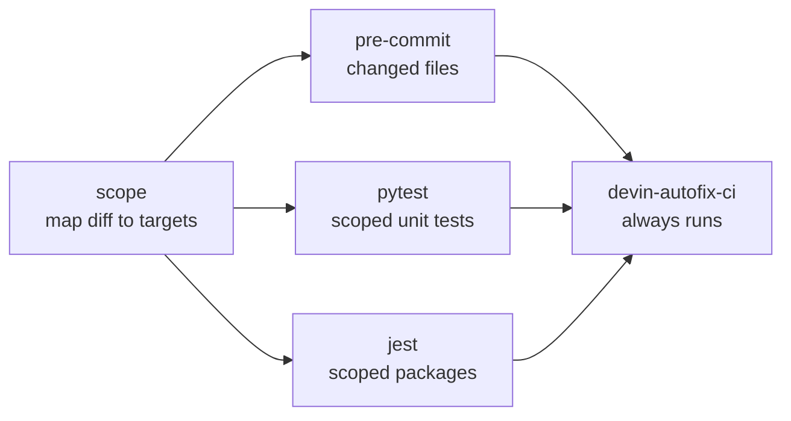

# Fork CI — `devin-autofix-ci.yml`

> **Status:** Design · **Answers:** What is the fork's CI signal, how do I install it, and what does it deliberately not cover?

This directory holds a workflow that belongs to **`taxpon/superset`**, not to this repository. It
is kept here because it is part of Sentinel's design ([08](../08-testing.md),
[B2](../blockers.md#b2)) and has to be reviewable alongside the state machine it feeds.

It is **not** under `.github/workflows/` in this repository on purpose: that directory is
Sentinel's own CI, and this file would run against the wrong codebase.

## Where it goes

| | |
|---|---|
| Repository | `taxpon/superset` (public fork of `apache/superset`) |
| Branch | `master` — the fork's default branch is not `main` ([B3](../blockers.md#b3)) |
| Path | `.github/workflows/devin-autofix-ci.yml` |

The file is self-contained: the diff-to-test-target mapping is inlined as a Python heredoc rather
than a checked-in script, so installing it is a single file copy.

## What it runs

Five jobs. `scope` resolves the diff once; the three signal jobs are gated on its outputs and run
in parallel; `devin-autofix-ci` is the conclusion.



### `scope` — how the scoping works

The diff base is `HEAD^1`. On a pull request the checked-out `HEAD` is GitHub's merge commit, so
its first parent is the *current* tip of the base branch. `pull_request.base.sha` is deliberately
not used: GitHub freezes it at PR creation, so on a long-lived branch it picks up every unrelated
change the base has taken since. If the base cannot be resolved the job **fails** rather than
checking nothing.

| Changed path | Target |
|---|---|
| `superset/<pkg>/<mod>.py` | `tests/unit_tests/<pkg>/<mod>_test.py`, `test_<mod>.py` or `<mod>_tests.py`, whichever exists |
| …with no file-level mirror | the nearest existing `tests/unit_tests/<pkg>/…` directory, walking up but **never** as far as `tests/unit_tests` itself |
| `tests/unit_tests/**` | the changed test file; for `conftest.py`, `__init__.py` or `fixtures/`, its containing directory |
| `tests/integration_tests/**` | nothing — reported as unmapped |
| `pyproject.toml`, `setup.py`, `pytest.ini`, `tests/conftest.py`, `requirements/*.txt` | the whole unit suite |
| `superset-frontend/{packages,plugins}/<pkg>/**` | jest pattern `superset-frontend/{packages,plugins}/<pkg>/` |
| `superset-frontend/{src,spec,tools}/<dir>/**` | jest pattern `superset-frontend/{src,spec,tools}/<dir>/` |
| `superset-frontend/src/<file>.ts` | jest pattern `superset-frontend/src/<file>` |
| `superset-frontend/package.json`, `package-lock.json`, root configs | nothing — reported as unmapped |

Three naming conventions are tried for the Python mirror because all three are in use — `pytest.ini`
declares `python_files = *_test.py test_*.py *_tests.py`, and the tree contains
`sql/parse_tests.py`, `sql/transpile_to_dialect_test.py` and `db_engine_specs/test_athena.py` side
by side. jest arguments are regular expressions matched against the full test path, which is what
makes a package-root prefix a valid scope.

Directory targets subsume anything beneath them, so pytest never collects the same file twice.

### `pre-commit`

`pre-commit run --files <changed>`. No hook list is passed: every hook already carries its own
`files:` filter, so a Python-only diff never invokes the frontend hooks. Node dependencies
(`npm ci` under `superset-frontend/`) and Go + `helm-docs` are installed **only** when the diff
actually contains frontend or `helm/` files, which is where most of the latency saving comes from.

Two hooks are skipped unconditionally:

- `type-checking-frontend` — `require_serial`, whole-project `tsc`; the upstream `pre-commit.yml`
  workflow skips it in CI too;
- `eslint-docs` — needs a `yarn install` under `docs/` to lint documentation JavaScript only.

The job also fails on a dirty working tree afterwards. Several hooks (`ruff --fix`, `oxfmt`, the
feature-flag doc sync) rewrite files instead of failing, and a rewritten file means the branch is
missing a change the hooks would have made.

The base branch is fetched explicitly as a remote-tracking ref. Without it the `pylint` hook's
`git merge-base origin/$GITHUB_BASE_REF HEAD` fails, the hook falls back to `BASE=HEAD`, diffs a
commit against itself and prints "No Python files to lint" — green and entirely vacuous.

### `pytest`

Reuses the fork's own `./.github/actions/setup-backend/` composite action at `python-version:
current` (which resolves to **3.11**; `pyproject.toml` declares `requires-python = ">=3.11"`). That
action installs `requirements/development.txt` with `uv pip install --system` and then `-e .`.
Environment matches the upstream `Python-Unit` job: `PYTHONPATH`, `SUPERSET_TESTENV`,
`SUPERSET_SECRET_KEY`, `SQLALCHEMY_WARN_20=1`.

pytest exit code 5 ("no tests collected") is reported as a warning rather than a failure: the
paths were resolved by existence, so it means the mirrored directory holds no test files — a real
gap in the signal, but not a fault of the change.

### `jest`

`npm ci` in `superset-frontend/` (npm workspaces: `packages/*`, `plugins/*`, `src/setup/*`; Node
pinned by `superset-frontend/.nvmrc`, currently **v24.16.0**), then
`npm run test -- --passWithNoTests <patterns>`. Upstream shards the full suite across eight
runners; running it unsharded here would cost more than the entire loop budget.

### `devin-autofix-ci`

Runs with `if: always()` and is the only job that determines the conclusion. It fails if any signal
job is anything other than `success` or `skipped`, and writes a job summary naming the exact scope
that was run.

## Why an untestable diff reports success

`check_suite.completed` drives Sentinel's state machine ([04](../04-state-machine.md),
[06](../06-event-pipeline.md)): `success` → `CI_PASSED`, `failure`/`timed_out` → resume the Devin
session. `neutral`, `skipped` and `cancelled` are mapped to nothing, and there is no timeout state
— a remediation that receives one sits in `CI_RUNNING` indefinitely.

A workflow whose jobs are all skipped concludes as `skipped`. So without an unconditional
aggregate job, a diff with no test target would silently hang the loop. The aggregate job therefore
reports **success**, and shouts about the vacuity instead: a `::warning::` annotation plus an
explicit job-summary note that the conclusion reflects `pre-commit` only and is not evidence the
change works. A human approves every merge ([ADR](../adr/2026-08-07-humans-approve-every-merge.md)),
so the warning reaches the decision that matters while the machine keeps moving.

`neutral` was rejected because it makes an *unrecoverable* failure mode (a stalled remediation, no
state, no escalation) out of a *recoverable* one (a green PR with a loud caveat on it).

Recorded in [ADR 2026-08-08](../adr/2026-08-08-vacuous-ci-reports-success.md).

Note that this case is rarer than it sounds: `pre-commit` runs whenever the diff contains *any*
file, so the truly empty conclusion only happens on a diff with no files at all. The common case is
a diff with files but no *test* target — docs, `helm/`, a lockfile bump — which still gets a
`pre-commit` signal.

## Installation

### 1. Register the fork's workflows — B2

Workflows on a fresh fork are **not registered until one has run**. `taxpon/superset` has Actions
enabled and 49 inherited workflow files, but the workflows API reports `total_count: 0`
([B2](../blockers.md#b2)) — nothing has ever run there. A workflow that is not registered cannot be
disabled, listed or required, and does not produce a check run.

Copy the file to `.github/workflows/devin-autofix-ci.yml` on `master`, then open **one throwaway
pull request** against `master` (a whitespace change to a Markdown file is enough) purely to make
the first run happen. Close it once the run appears. Do this before relying on CI for anything.

### 2. Make the head SHA produce exactly one conclusion

The 49 inherited workflows trigger on `pull_request` too, and once registered they will run on
every remediation PR. Both possible groupings of check runs are bad for the loop:

- if GitHub groups all of a SHA's Actions check runs into **one** check suite, its conclusion is
  gated by the slowest inherited workflow — the tens-of-minutes latency this workflow exists to
  avoid;
- if each workflow run gets its **own** check suite, Sentinel receives ~49 `check_suite.completed`
  events per SHA and would transition to `CI_PASSED` on the first trivially-passing one, long
  before the real tests finish — a false green.

The remedy is the same either way, so it does not need to be resolved first: disable everything
except this workflow on the fork, so a head SHA yields one conclusion and it is this one.

```bash
gh workflow list -R taxpon/superset --all --json name,path,id \
  --jq '.[] | select(.path != ".github/workflows/devin-autofix-ci.yml") | .id' \
  | xargs -n1 gh workflow disable -R taxpon/superset
```

`gh workflow disable` only works on registered workflows, so this runs *after* step 1. If the
inherited workflows never register (they will not run until a PR touches their triggers), delete
them from `.github/workflows/` on the fork's `master` instead — the same commit that adds this
file is a good place for it.

Which grouping GitHub actually uses is worth recording on the activation PR:

```bash
gh api "repos/taxpon/superset/commits/<head-sha>/check-suites" --jq '.total_count'
```

### 3. Verify

The activation PR is also the first real measurement. Record the wall-clock time and update
[B11](../blockers.md#b11) and this file with it.

## What the narrowing costs

This workflow is a **deliberate narrowing of the CI signal** and must never be reported as
full-suite validation ([08](../08-testing.md#ci-on-the-fork),
[ADR](../adr/2026-08-07-scoped-ci-on-the-fork.md)). What it gives up:

| Not covered | Consequence |
|---|---|
| `tests/integration_tests/**` — the whole database-backed suite (MySQL, Postgres, Presto/Hive, Redis) | The largest gap by far. Anything about SQL execution, migrations against a real database, or security across a request cycle is unverified here. |
| e2e, Playwright, Storybook interaction tests | No signal on rendered behaviour. |
| Helm lint/test, Docker builds, the docs site build | A change to `helm/` or `Dockerfile` gets whitespace and YAML hooks and nothing else. |
| Frontend type-checking (`tsc`) and the full `npm run lint` | A type error outside the touched package's own tests is not caught. |
| Python versions other than 3.11 | Upstream also runs PRs on `current` only, so this matches. |
| **Tests outside the touched package** | The core trade. A change to `superset-ui-core` that breaks a *consumer* plugin's tests passes here. Jest's `--findRelatedTests` would close this, at the cost of building the full dependency graph on every run. |
| Frontend and Python **dependency** changes | A lockfile bump maps to no jest scope at all (Python dependency changes do map to the whole unit suite). Reported as unmapped. |
| Tests living in `superset-frontend/spec/` for source in `src/` | Scoping is by directory, so a co-located test is found and a `spec/`-side test for the same code is not. |

Two mitigations, both stated rather than assumed:

1. Every diff that maps to nothing testable produces a `::warning::` naming the unmapped paths, so
   the gap is visible on the pull request instead of implied by a green tick.
2. Where a remediation touches an area covered by a heavier inherited workflow, that workflow is
   run on the pull request before merge ([08](../08-testing.md#ci-on-the-fork)). With the
   inherited workflows disabled per step 2 above, use `gh workflow enable` and
   `gh workflow run` for the specific one.

## Expected wall-clock time

Jobs after `scope` run in parallel, so the total is `scope` plus the slowest signal.

| Job | Estimate | Basis |
|---|---|---|
| `scope` | 1–2 min | Blobless full-history checkout (`filter: blob:none`) plus a pure-Python mapping step |
| `pre-commit` | 6–9 min | `setup-backend` (apt, `requirements/development.txt` via `uv`, `-e .`) plus cached pre-commit environments; upstream's equivalent job budgets 20 min while *also* running `npm ci`, a docs `yarn install` and a `go install` unconditionally |
| `pytest` | 5–8 min | The same `setup-backend`, then a scoped subset of a suite upstream budgets 30 min for in full |
| `jest` | 7–12 min | `npm ci` with the setup-node cache, then a scoped subset of a suite upstream shards across 8 runners at 20 min each |
| `devin-autofix-ci` | < 1 min | |

**Total: roughly 8–14 minutes**, dominated by environment setup rather than by the tests. Compare
`superset-e2e`, `superset-playwright` and the integration matrix, which are tens of minutes each.

This is an estimate derived from the timeouts and setup steps declared in the fork's own workflows,
**not a measurement** — nothing has run on the fork yet ([B2](../blockers.md#b2)). The activation PR
in step 1 produces the first real number.

If it proves too slow, the setup cost is the thing to attack, not the test scope: the upstream
frontend jobs avoid `npm ci` entirely by building a `superset-node-ci` Docker image once and
reusing it across jobs.

## Interactions worth knowing

- **`concurrency` cancels superseded runs.** When Devin pushes a fix, the run for the previous head
  SHA is cancelled and concludes as `cancelled`, which Sentinel does not map. That is correct here:
  the cancelled suite belongs to a SHA the remediation is no longer tracking, and the new SHA
  produces its own conclusion. It would only matter if a run were cancelled for the *current* head
  SHA.
- **No `paths:` filter, on purpose.** A workflow filtered out by path produces no check run at all,
  and the remediation would sit in `PR_OPENED` with nothing to advance it. Every pull request must
  produce a conclusion, even a vacuous one.
- **Draft pull requests** trigger on `opened` and on `ready_for_review`, so a Devin PR opened as a
  draft still gets a signal.

## Validation performed

- `actionlint` 1.7.12 with `shellcheck` 0.11.0: clean, apart from `label "ubuntu-26.04" is
  unknown` — actionlint's built-in label list predates that image, and all 49 of the fork's own
  workflows already use it.
- The inline mapping script was extracted and run against a real checkout of `taxpon/superset`
  (`f5bca3b`) over a set of representative paths; every resolved target was confirmed to exist in
  that tree.
- Verified against the fork rather than assumed: Python 3.11 (`pyproject.toml`,
  `setup-backend/action.yml`), the `uv pip install --system -r requirements/development.txt`
  install path, `pre-commit==4.1.0` / `ruff==0.9.7` / `pylint==3.3.7` in `development.txt`, npm (not
  yarn or pnpm) with workspaces `packages/*`, `plugins/*`, `src/setup/*`, Node `v24.16.0` from
  `.nvmrc`, the `jest.config.js` `testRegex`, the `pytest.ini` `python_files` patterns, and the
  action SHA pins, which are copied from the fork's existing workflows.
