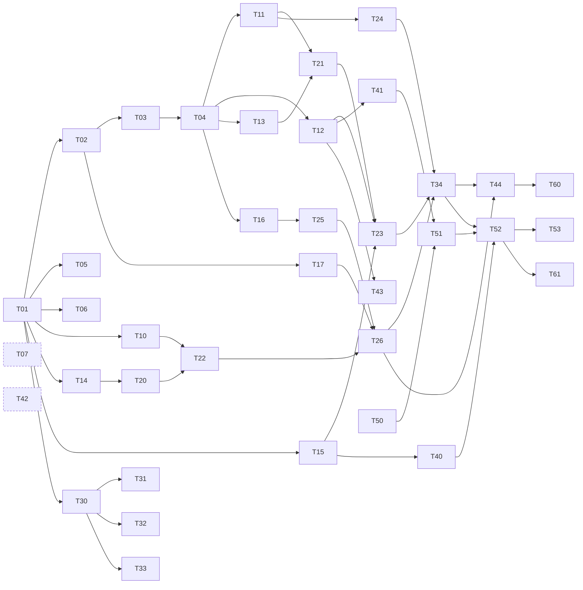

# Implementation plan

> **Status:** Living · **Answers:** What is left to build, in what order, and how do parallel sessions divide the work without colliding?

## Cold start

**If you have no context, start here.** This section is written so that a fresh session can pick up
work without anyone explaining anything.

```bash
# 1. Where am I, and is there work assigned to this tree?
git branch --show-current

# 2. What is open?
gh issue list -R taxpon/sentinel --label task --state open \
  --json number,title,labels,assignees

# 3. Claim one whose dependencies are all merged (see the task table below)
gh issue edit <N> -R taxpon/sentinel --add-assignee @me --add-label status:claimed

# 4. Work in an isolated tree
git worktree add ../wt/T14-state-machine -b task/T14-state-machine
```

Read in this order before writing code:

1. [`index.md`](./index.md) — the map
2. The **Spec** section named in your issue — usually one document, not all of them
3. [`adr/index.md`](./adr/index.md) — decisions already made; look up the entries listed on your issue
4. [`blockers.md`](./blockers.md) — what is known to be broken or unavailable

Do **not** read every document. The issue names the spec it implements; that plus the ADRs it lists
is the working set.

## Ground rules

| Rule | Why |
|---|---|
| One issue, one branch, one PR | Keeps review small and dependencies legible |
| Branch name `task/T<id>-<slug>` | The SessionStart hook uses it to identify your task |
| **Never modify files outside your issue's "Owned files"** | This is the entire collision-avoidance strategy for parallel sessions |
| The spec is authoritative | If the code must diverge from `docs/`, change `docs/` in the same PR and say why |
| Record non-obvious decisions as ADRs | See [ADRs](#adrs) |
| PR body contains `Closes #<N>` | Closes the issue and keeps the trail |
| Releasing a task means removing the assignee and `status:claimed` | So the next session can see it is free |

### Shared files

A few files cannot be exclusively owned. These rules stop them becoming merge battlegrounds.

| File | Rule |
|---|---|
| `pyproject.toml` dependencies | Append only your own dependencies. Line-level conflicts here are trivial to resolve |
| `src/sentinel/api/main.py` | **T26 is the only owner.** Other tasks export a router; T26 registers it |
| `alembic/versions/` | **T03 creates the one initial migration.** A later task needing a schema change coordinates on that issue rather than adding a migration |
| `Dockerfile` | **T01 owns the Python image.** T30 adds the dashboard build stage when `dashboard/` exists — a stage that copies a directory nobody has created yet would only break `docker build` on `main` |
| `uv.lock` | Regenerated by `uv sync`, never hand-edited. Resolve a conflict by taking either side and re-running `uv lock` |
| `docs/` specs | Edit only the section your task implements |
| `docs/adr/index.md`, `.claude/rules/adr-pointers.md` | **Generated on `main` after a merge.** Do not commit them from a branch — CI fails a pull request that does. Add your record; the index catches up |
| `docs/02-architecture.md` Design decisions table | Every `type: architecture` ADR needs a row, and a test enforces it. Two tasks each adding one conflict on the same spot — resolve by keeping both rows |
| `dashboard/src/fixtures/summary.ts`, `dashboard/src/setup-tests.ts` | **T30 created them; T31–T33 may append only.** Add a fixture or a setup line; never edit or delete what another panel task relies on |

## Parallel sessions

Each session works in its own git worktree, sharing one `.git` directory:

```bash
git worktree add ../wt/T11-devin-client -b task/T11-devin-client
# ... work, commit, /finish-task, open PR ...
git worktree remove ../wt/T11-devin-client
```

Tests need Postgres. Two sessions running `make test` at once will collide on the container name and
port, so each worktree exports a distinct project name and port:

```bash
export COMPOSE_PROJECT_NAME=sentinel-t11
export POSTGRES_PORT=54321          # pick a free port per worktree
export API_PORT=8001                # only needed if you run `make up`
```

`make db` creates `.env` from `.env.example` if it is missing — Compose refuses to load the project
without it, and an untracked `.env` does not follow you into a new worktree.

### What runs at session start

`.claude/hooks/session-init.sh` fires on `SessionStart` and injects live state that no static
document can carry:

- the branch and, if it matches `task/T<id>-*`, that issue's goal, owned files and definition of done;
- otherwise, the **ready** tasks — every dependency merged and no assignee — in wave order;
- the ADRs linked to the current task;
- the count of open items in [`blockers.md`](./blockers.md).

### Definition of done

Every task. Also mirrored in the issue body and the PR template.

- [ ] Implemented as specified
- [ ] Unit tests added; `make test` is green
- [ ] `ruff` and `mypy` pass
- [ ] No files outside "Owned files" were changed
- [ ] `/finish-task` run: review applied, no findings remaining
- [ ] Divergence from the spec fixed in `docs/`
- [ ] Non-obvious decisions recorded as ADRs; the record committed, the generated index not

UI tasks (T30–T33) additionally require component tests. See
[`.claude/rules/ui-testing.md`](../.claude/rules/ui-testing.md) — browser-level tests are out of
scope, and `tests/test_e2e.py` (T34) is unaffected by that.

## ADRs

`docs/` records **what** was decided. [`docs/adr/`](./adr/index.md) records **why**, and what was
rejected. Write one when at least two of these hold:

- there were several defensible options and you picked one;
- someone will later ask "why is it like this?";
- reversing it is expensive — schema, external API usage, process;
- the reason cannot be read off the spec.

Do not write one for following a library's idiom, for something the spec already justifies, or for a
local and obvious choice.

Filenames are `YYYY-MM-DD-slug.md` — **not** sequential numbers, which parallel sessions would
allocate twice. The index and the path-scoped pointer rules are generated from ADR front matter,
**on `main`, after a pull request merges** (`.github/workflows/adr-index.yml`). A branch adds its
record and leaves them alone, so two branches adding a record share no file and cannot conflict.

## Task graph

The authoritative machine-readable source is [`tasks.yaml`](./tasks.yaml). Issues, the SessionStart
hook and this table are all derived from it.

Dependencies mean "that task's PR is merged". Tasks within a wave are independent.

### Wave 0 — foundation (serial; everything depends on it)

| ID | Task | Owns | Depends on |
|---|---|---|---|
| T01 | Repository scaffolding and tooling | `pyproject.toml`, `uv.lock`, `Makefile`, `Dockerfile`, `docker-compose.yml`, `.env.example` | — |
| T02 | Configuration module | `src/sentinel/config.py` | T01 |
| T03 | Database layer, models, initial migration | `src/sentinel/db.py`, `models.py`, `alembic/` | T02 |
| T04 | Test harness and fixtures | `tests/conftest.py`, `factories.py`, `fixtures/github/` | T03 |
| T05 | CI for this repository | `.github/workflows/ci.yml` | T01 |
| T06 | Claude Code collaboration setup | `CLAUDE.md`, `.claude/`, PR template | T01 |
| T07 | ADR framework, generated index, back-filled decisions | `docs/adr/`, `scripts/gen_adr_index.py` | — |

### Wave 1 — leaf modules (eight-way parallel)

| ID | Task | Owns | Depends on |
|---|---|---|---|
| T10 | Webhook signature verification | `security/hmac.py` | T01 |
| T11 | Devin API v3 client | `devin/client.py`, `devin/schemas.py` | T02, T04 |
| T12 | GitHub API client | `github/client.py` | T02, T04 |
| T13 | Postgres-backed job queue | `queue.py` | T03, T04 |
| T14 | Remediation state machine | `pipeline/state.py` | T01 |
| T15 | Playbooks, prompts, structured output schema | `devin/playbooks.py` | T01 |
| T16 | Analytics computation | `analytics/metrics.py` | T03, T04 |
| T17 | Structured logging and Prometheus metrics | `observability/` | T02 |

### Wave 2 — composition

| ID | Task | Owns | Depends on |
|---|---|---|---|
| T20 | Event to intent mapping | `github/events.py` | T14, T04 |
| T21 | Policy — dedup, concurrency, ACU budget | `policy/` | T03, T11, T13 |
| T22 | Webhook endpoint | `api/webhooks.py` | T10, T13, T20 |
| T23 | Worker and job handlers | `pipeline/worker.py`, `handlers.py` | T11, T12, T13, T14, T15, T21 |
| T24 | Devin session poller | `pipeline/poller.py` | T11, T14 |
| T25 | Analytics API | `api/analytics.py` | T16 |
| T26 | Application wiring and health | `api/main.py`, `health.py`, `__main__.py` | T22, T25, T17 |

### Wave 3 — dashboard and end-to-end

The dashboard's API contract is already fixed in [`07-observability.md`](./07-observability.md), so
T30 does not wait for T25.

| ID | Task | Owns | Depends on |
|---|---|---|---|
| T30 | Dashboard scaffold | `dashboard/` config, `src/api.ts`, `src/theme.css` | T01 |
| T31 | KPI row, funnel, throughput | `dashboard/src/panels/{Kpi,Funnel,Throughput}.tsx` | T30 |
| T32 | Durations, cost, autonomy, failures | `dashboard/src/panels/{Durations,Cost,Autonomy,Failures}.tsx` | T30 |
| T33 | Live remediation table and timeline | `dashboard/src/panels/{LiveTable,Timeline}.tsx` | T30 |
| T34 | End-to-end test including the review-fix loop | `tests/test_e2e.py` | T23, T24, T26 |

### Wave 4 — bootstrap and operations

| ID | Task | Owns | Depends on |
|---|---|---|---|
| T40 | Devin bootstrap script | `scripts/bootstrap_devin.py` | T11, T15 |
| T41 | GitHub bootstrap script | `scripts/bootstrap_github.py` | T12 |
| T42 | Lightweight CI workflow on the fork | `taxpon/superset` workflow | — |
| T43 | Vulnerability scanner that files issues | `scanner/audit.py` | T12 |
| T44 | README | `README.md` | T26, T34 |

### Wave 5 — remediation

| ID | Task | Owns | Depends on |
|---|---|---|---|
| T50 | Triage Superset, select eight targets | `docs/remediation-candidates.md` | — |
| T51 | File the eight issues on the fork | — | T50, T41 |
| T52 | Execute and monitor the runs | `docs/run-log.md` | T51, T34, T40 |
| T53 | Calibrate ACU caps from measured runs | — | T52 |

### Wave 6 — delivery

| ID | Task | Owns | Depends on |
|---|---|---|---|
| T60 | Pre-publication audit; make repository public | — | T44 |
| T61 | Presentation structure and script | `docs/presentation.md` | T52 |

## Dependency graph



`T07` and `T42` have no dependencies (dashed). Neither does `T50`.

## Sequencing

**Critical path:** `T01 → T02 → T03 → T04 → T11 → T21 → T23 → T34 → T52 → T61`

Two things should start immediately alongside T01, because nothing gates them:

- **T50** — triaging Superset for remediation targets is pure research and takes real time;
- **T07** — the ADR framework, so decisions made during waves 0–2 are captured as they happen rather
  than reconstructed later.

**Expect T52 onwards to stall** on Devin credentials ([B8](./blockers.md)). Everything up to and
including T34 is buildable without them, because the Devin API is faked with `respx` in tests. Use
that window to finish waves 0–4 rather than waiting.

## Status

Task status lives on the GitHub issues, not in this file — a checklist here would go stale the
moment two sessions work in parallel.

```bash
gh issue list -R taxpon/sentinel --label task --state all \
  --json number,title,state,assignees
```
